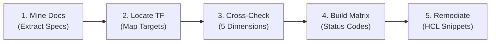

# Auditing Terraform Configurations Against Design Documentation

This skill guides the agent in conducting a rigorous cross-verification between Terraform Infrastructure-as-Code (IaC) files and project architectural documentation (Technical Design Documents, Architecture Decision Records, RFCs, and READMEs).

---

## Why Audit Terraform Against Documentation?

Starter packs and infrastructure templates typically ship with minimal or placeholder defaults (e.g., 1 vCPU, 8 request concurrency, 1 min instance, no VPC access, and unbounded storage retention). Architectural documents, by contrast, specify contractual commitments:
- **SLO & Latency Budgets**: Require specific compute allocations (e.g., 2 vCPU, concurrency = 80).
- **FinOps & Cost Models**: Require scale-to-zero (`min_instances = 0`) and automated GCS lifecycle deletion rules.
- **Security & Network Isolation**: Mandate Direct VPC Egress, private subnets, and least-privilege IAM roles.
- **Location Pinning**: Distinguish regional services (e.g., `asia-northeast3`) from global foundation model endpoints (`location="global"`).

Auditing detects drift early—before deployment costs spike, security audits fail, or production services suffer capacity bottlenecks.

---

## Quick Start

### 1. Automated Pre-Flight Scan

Run the bundled scanner to extract declared resources, compute sizing, database versions, and storage configurations, cross-referencing them against the design document:

```bash
python .agents/skills/audit_terraform_docs/scripts/scan_resources.py deployment/terraform/single-project --doc docs/design/TDD.md
```

To export structured findings as JSON for programmatic analysis:

```bash
python .agents/skills/audit_terraform_docs/scripts/scan_resources.py deployment/terraform/single-project --doc docs/design/TDD.md --json
```

### 2. Reference Checklist & Examples

- Consult the [Attribute Checklist](references/checklist.md) for a comprehensive list of inspectable fields by GCP resource type.
- Inspect the [Sample Audit Report](examples/sample_audit_report.md) for standard reporting formatting.

---

## The 5-Step Audit Procedure

Follow this systematic procedure on every audit:



### Step 1: Mine Design Documentation
Locate and extract specifications from the primary architecture documents:
1. `docs/design/TDD.md` (or root `TDD.md`):
   - **Section 8 (Detailed Design)**: Cloud Run container framework, middleware, and subagent runtimes.
   - **Section 9 (Data Model)**: Persistent stores table (GCS bucket URIs, Cloud SQL engine, retention period, encryption).
   - **Section 10.2 (Consumed APIs)**: Endpoint locations, expected QPS, and Google Cloud APIs.
   - **Section 11 (Security and Privacy)**: Direct VPC egress, subnet names, IAM commitments, Model Armor.
   - **Section 14 (Performance & Capacity Sizing)**: vCPU, RAM, concurrency, `min_instances`, `max_instances`.
2. `docs/adr/*.md`:
   - Inspect ADRs for location pinning (e.g., `location="global"` for Vertex AI models vs regional hosting).
   - Inspect ADRs for persistence patterns (e.g., Cloud SQL PostgreSQL vs local SQLite fallback).

### Step 2: Map Target Terraform Files
Identify all relevant Terraform definitions in the workspace:
- `deployment/terraform/single-project/` (single environment / developer deployments)
- `deployment/terraform/cicd/` (multi-environment / CI/CD pipeline deployments)
Key files to inspect:
- `service.tf`: `google_cloud_run_v2_service`, `google_sql_database_instance`, `google_secret_manager_secret`
- `storage.tf`: `google_storage_bucket`, retention policies, lifecycle rules
- `apis.tf`: `google_project_service` enabled APIs
- `iam.tf`: `google_service_account`, `google_project_iam_member`, role bindings
- `variables.tf`: Default region, project naming, and input variables

### Step 3: Cross-Check Across 5 Core Dimensions

Execute checks systematically across these five dimensions:

1. **Compute & Sizing (Cloud Run)**:
   - Compare `resources.limits.cpu` and `memory` against doc capacity sizing.
   - Compare `max_instance_request_concurrency` against target concurrency.
   - Verify `min_instance_count` matches scale-to-zero expectations (`0` vs `1`).
   - Verify `max_instance_count` matches cost ceiling caps.
2. **Databases & Persistence (Cloud SQL & Sessions)**:
   - Check `database_version` matches the documented engine (e.g. `POSTGRES_15`).
   - Check machine `tier` (e.g. `db-custom-1-3840`).
   - Check `database_flags` (e.g. IAM authentication `on`).
   - Verify backup configuration matches disaster recovery commitments.
3. **Object Storage (Cloud Storage)**:
   - Ensure every bucket documented in persistent stores (e.g. `gs://mvc-artifacts-*`) exists in Terraform.
   - Check `uniform_bucket_level_access = true`.
   - Verify `lifecycle_rule` / `retention_policy` enforces documented retention limits (e.g. 30 days).
4. **Networking & Security**:
   - Check for `vpc_access` block configuring Direct VPC Egress or Serverless VPC Access connector.
   - Check subnet targeting (e.g. `asia-northeast3-subnet`).
   - Check egress settings (`ALL_TRAFFIC` vs `PRIVATE_RANGES_ONLY`).
   - Verify service account uses dedicated least-privilege identity instead of default compute SA.
5. **Region & Location Pinning**:
   - Confirm infrastructure region `var.region` matches project region (e.g. `asia-northeast3`).
   - Confirm environment variables passed to services (e.g. `GOOGLE_CLOUD_LOCATION="global"`) correctly reflect ADR decisions for model availability.

### Step 4: Build the Findings Matrix

Classify every finding using standard status codes:

| Status Code | Meaning | Action Required |
| :--- | :--- | :--- |
| `MATCH` | Terraform configuration perfectly matches design specification. | None (Confirmed). |
| `MISMATCH` | Resource exists in both, but attribute values differ (e.g., CPU 1 vs 2). | Update Terraform or justify in doc. |
| `MISSING_IN_TF` | Resource or policy is mandated in docs but completely absent in `.tf`. | Create Terraform resource block. |
| `UNDOCUMENTED_IN_DOCS` | Resource is provisioned in Terraform but omitted from design docs. | Document in TDD or remove if unneeded. |

### Step 5: Formulate Remediation

Provide exact, copy-pasteable HCL snippets or documentation revision suggestions:
- Prioritize **CRITICAL** (missing network egress, public exposure) and **HIGH** (CPU/concurrency mismatches causing SLO failure) items first.
- Clearly note the file and line number for each proposed modification.

---

## Report Presentation Template

When presenting audit results to the user, follow this structured format:

```markdown
# Infrastructure vs Documentation Audit Report

- **Target Documentation**: `docs/design/TDD.md`
- **Terraform Directory**: `deployment/terraform/single-project/`
- **Status Summary**: <N> Mismatches, <N> Missing in Terraform, <N> Matches

## Findings Matrix

| Ref ID | Category | Resource / Component | Documented Spec | Terraform Value | Severity | Status |
| :--- | :--- | :--- | :--- | :--- | :---: | :---: |
| AUD-01 | Compute | Cloud Run CPU | `2 vCPU` (TDD Sec 14) | `cpu = "1"` (`service.tf:116`) | HIGH | MISMATCH |
| AUD-02 | Network | Direct VPC Egress | `asia-northeast3-subnet` | Missing (`service.tf`) | CRITICAL | MISSING_IN_TF |

## Recommended Remediation

### 1. [Fix Title] (`path/to/file.tf`)
```hcl
# Precise replacement snippet
```
```

---

## Common Traps to Avoid

- **Do NOT assume starter pack values are intentional**: Starter packs generated by scaffolding CLIs (e.g., `agents-cli infra single-project`) contain generic baseline defaults. Always treat the project's TDD/ADR as the source of truth.
- **Watch for two-way drift**: Check both directions:
  1. *Doc $\to$ Terraform*: Is everything in the design actually implemented?
  2. *Terraform $\to$ Doc*: Are there resources in Terraform (e.g., BigQuery telemetry tables, Cloud Logging sinks) that the architecture doc failed to document or budget for?
- **Distinguish local fallback from remote deployment**: Check ADRs before flagging local development configurations (such as SQLite fallbacks in application code) as Terraform mismatches when the remote spec uses Cloud SQL.
