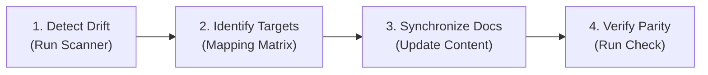

# Codebase Documentation Synchronization (`sync-docs`)

This skill guides the agent in conducting a systematic audit of code modifications and reconciling all impacted project architectural documentation, contracts, design specifications, and runbooks.

---

## Why Synchronize Codebase Documentation?

In fast-iterating AI systems, documentation drift creates critical failure modes:
- **Contract Breakage**: Modifying API endpoints (`app/routers/`) without updating `api/openapi.yaml` breaks frontend TypeScript code generation and automated contract tests.
- **Model Inconsistency**: Changing model IDs or location settings without updating `docs/design/TDD.md §2` or `docs/adr/0002-*.md` leads to deployment failures (e.g., Regional 404/501 errors).
- **Data Model Misalignment**: Altering database schemas or migrations without updating `docs/design/TDD.md §9` breaks Cloud Run DB migration checks (`alembic check`).
- **SRE & Runbook Drift**: Modifying environment settings or guardrails without updating operational runbooks (`docs/runbooks/`) causes prolonged MTTR during incidents.

---

## Quick Start

### 1. Automated Drift Detection Scan

Run the bundled scanner to inspect all uncommitted git changes (or diff against a base branch) and identify which documentation files require synchronization:

```bash
uv run python .agents/skills/sync_docs/scripts/detect_doc_drift.py
```

To run as an automated verification check (exits with code `1` if drift is detected):

```bash
uv run python .agents/skills/sync_docs/scripts/detect_doc_drift.py --check
```

For JSON-formatted output suitable for automated tooling:

```bash
uv run python .agents/skills/sync_docs/scripts/detect_doc_drift.py --json
```

---

## The 4-Step Documentation Synchronization Workflow



### Step 1: Detect Drift

Inspect the git modifications using either `detect_doc_drift.py` or manual inspection:

```bash
git status --porcelain
```

Classify every modified file into its corresponding subsystem:
- **Backend APIs & Routing**: `app/routers/`, `app/fast_api_app.py`, `app/schemas/`
- **Data Models & Storage**: `app/models/`, `alembic/`, `app/session_repo.py`, `app/storage_service.py`
- **Subagents & Reasoning Engines**: `app/agents/`, `scripts/deploy_subagents.sh`
- **Orchestration & Workflow**: `app/orchestrator/`, `app/campaign_runner.py`
- **Infrastructure & Cloud Build**: `deployment/terraform/`, `.cloudbuild/`, `Dockerfile`
- **Security & Guardrails**: `app/security.py`, `model_armor.tf`
- **Frontend SPA**: `frontend/src/`
- **Evaluation & Benchmarks**: `eval/`, `tests/eval/`, `scripts/eval_gate.py`
- **Configuration & Environment**: `app/settings.py`, `.env.example`

### Step 2: Identify Affected Documentation Targets

Consult the [Subsystem-to-Documentation Mapping Reference](references/doc_mapping.md) for the exact documentation targets.

Key document targets:
1. **`docs/design/TDD.md`** (Primary Source of Truth):
   - **Section 2**: Foundation model endpoints, pinning (`location="global"`).
   - **Section 4**: DAG lifecycles, states, review actions (`approve`, `revise`), rollback ($N \to N-1$).
   - **Section 7**: System topology, Cloud Run, Cloud SQL, GCS.
   - **Section 8**: Subsystem component design and class responsibilities.
   - **Section 9**: Data model, database tables, GCS directory layout.
   - **Section 10**: REST API contracts, parameters, response codes.
   - **Section 11**: Security, OAuth OIDC, Model Armor guardrails, Direct VPC Egress.
   - **Section 14**: Sizing, vCPU, RAM, concurrency, min/max instances.
2. **`api/openapi.yaml`**: Canonical OpenAPI 3.1.0 contract.
3. **`docs/adr/`**: Architecture Decision Records (`0001` through `0009` and `README.md`).
4. **`docs/EVAL.md`**: Eval scenarios, LLM judge calibrations, eval gate thresholds.
5. **`docs/ENGAGEMENT.md`**: Milestone tracking and delivery status.
6. **`docs/runbooks/`**: `model-swap.md`, `incident-response.md`.
7. **`README.md`**: User-facing setup, quick-start, and architecture overview.

### Step 3: Synchronize Document Content

Perform targeted updates using `replace_file_content` or `write_to_file`:
- **Preserve Structure**: Keep existing document sections, numbering, and formatting intact.
- **Precision**: Replace outdated paths, parameters, model names, and schemas with exact values.
- **Cross-References**: When adding new architectural patterns, create or update the corresponding ADR in `docs/adr/` and update `docs/adr/README.md`.
- **Bidirectional Verification**: Ensure that what is in the code is accurately reflected in the doc, and what is described in the doc accurately matches the code.

### Step 4: Verify Consistency

Re-run the drift scanner to confirm all modified code categories have matching document updates:

```bash
uv run python .agents/skills/sync_docs/scripts/detect_doc_drift.py --check
```

Ensure unit and integration tests pass after documentation updates:

```bash
uv run pytest tests/unit
```

---

## Common Traps to Avoid

- **Forgetting `api/openapi.yaml`**: Changing FastAPI router schemas without updating `api/openapi.yaml` breaks contract-first guarantees.
- **Forgetting TypeScript Types in Frontend**: Modifying backend deliverable schemas in `app/schemas/` requires updating `frontend/src/types/deliverables.ts`.
- **Overwriting Section Numbering in `TDD.md`**: `TDD.md` is normalized to 20 canonical sections. Do not delete or renumber sections; update the specific subsection content.
- **Stale ADRs**: When an architectural decision is modified (e.g. switching an AI model or revising persistence strategy), update the ADR's revisit notes or author a superseding ADR.
- **Infinite Stop Hook Loop**: Always verify that the documentation changes are reflected in the session transcript before concluding the turn so automated lifecycle hooks succeed.
