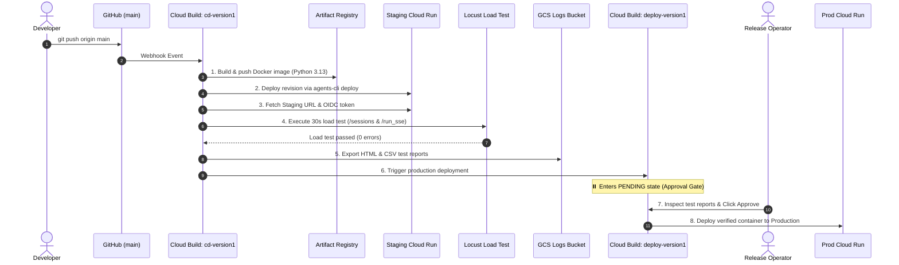

# Technical Design Document: Marketing Value Creator (MVC) v1.0

## 1. Metadata
- **Status**: Approved / Production Deployed (Staging Verified, Prod Awaiting Approval)
- **Stakes tier**: `standard`
- **Sections dropped**: `none`
- **Date last updated**: 2026-08-28
- **Authors**: Ryan Ahn (ryanahn@, Forward Deployed Engineer)
- **Approvers**: Executive Sponsor, FDE Engineering Manager
- **Source repo**: ryanahn-google/version1
- **Live Staging Endpoint**: `https://version1-797135441724.asia-northeast3.run.app`

---

## 2. TL;DR
The Marketing Value Creator (MVC) is an enterprise generative AI campaign planning platform built for Nova Electronics Corp to compress manual 4-to-6-week cross-agency marketing workflows into an interactive simulation taking minutes. Built using Google ADK and FastAPI, the system deploys a containerized Cloud Run service (`version1`) in `asia-northeast3` hosting a React Single Page Application (SPA) and an Orchestration Engine (powered by **Gemini 3.1 Pro**).

The Orchestrator coordinates four specialized sub-agents running on Vertex AI Agent Runtime / Reasoning Engine ([P1] Market Sensing, [P2] Strategy & Brief, [P3] Creative Content, [P4] Performance & Insights) via direct Agent-to-Agent (A2A) protocol. Sub-agents P1, P2, and P4 utilize **Gemini 3.5 Flash Lite** targeting Vertex AI `global` endpoints to generate structured JSON artifacts, while P3 leverages **Imagen 3** (`imagen-3.0-generate-002`) to produce high-resolution marketing visuals saved to Google Cloud Storage.

Marketers inspect intermediate deliverables at each stage through an interactive Web UI secured by **Google OAuth 2.0 OIDC**, with Human-in-the-Loop (HITL) approval gates. Campaign workflow states, deliverables, and ADK session histories are persisted in **Google Cloud SQL (PostgreSQL 15)** mounted securely over Cloud SQL Auth Proxy Unix domain sockets, preventing public database exposure. The entire system is governed across 3 dedicated GCP projects (`capstone-cicd`, `capstone-staging-506811`, `capstone-prod-506811`) using 100% Terraform Infrastructure-as-Code and automated Cloud Build CI/CD with Locust load-test validation and a native Production Approval Gate.

---

## 3. Background and Context
Today, campaign planning at Nova Electronics Corp is fragmented across regional brand teams, creative agencies, and media planners. Preparing a single multi-channel campaign brief requires weeks of manual desk research, briefing cycles, creative storyboarding, and spreadsheet KPI modeling.

Previous attempts using standard chat interfaces failed due to context loss, lack of domain specialization, and zero cross-agent coordination. MVC establishes an automated, audit-logged simulation pipeline that generates structured briefs, visual concepts, and defensible budget allocations under strict corporate brand guardrails.

---

## 4. Goals and Non-Goals

### Goals (MVP & Production Scope)
- **Multi-Agent Campaign DAG**: Autonomous sequential execution of Market Sensing $\to$ Strategy & Brief $\to$ Creative Content $\to$ Performance & Insights.
- **Structured Deliverables**: P1, P2, P4 output strictly validated JSON deliverables; P3 generates marketing campaign image files (PNG/JPEG).
- **Interactive HITL Revision Gates**: Marketers can inspect intermediate outputs in real time, submit text feedback for re-generation, or approve progression.
- **Enterprise Security**: Google OAuth 2.0 OIDC authentication on all API requests, Google Cloud Model Armor prompt sanitization, Direct VPC Egress (`asia-northeast3-subnet`), and Cloud SQL Auth Proxy socket connectivity.
- **Managed Dual-Layer Session Persistence**: Resilience against Cloud Run scale-to-zero during marketer review pauses using Cloud SQL PostgreSQL 15 storing both ADK chat sessions and campaign orchestrator deliverable models.
- **100% Terraform IaC & Automated CI/CD**: Fully reproducible deployment across 3 GCP projects with Cloud Build automated PR testing, Staging auto-deployment, automated Locust load test gate, and a manual Production Approval Gate.

### Non-Goals (Contractual Boundary / Post-MVP)
- **Live Media Buying Transactions**: Automated ad spend execution via DSP/AdTech APIs is strictly out of scope for sandbox.
- **Customer PII Processing**: No real consumer PII; synthetic marketing benchmarks and public trend data only.
- **Legacy ERP/SAP Connectors**: Enterprise system-of-record integration deferred to enterprise rollout.
- **Complex Multi-page Dashboards**: Replaced by a streamlined React single-page console.
- **Non-Google SSO**: Third-party IdPs (Okta, Azure AD, SAML 2.0) excluded; strictly Google OAuth for MVP.

---

## 5. Success Criteria
- **Quality Metric**: Intent classification accuracy $\ge 90\%$ (Gemini 3.1 Pro); Golden eval dataset quality score $\ge 4.0 / 5.0$ (LLM-as-a-Judge); $100\%$ JSON schema compliance for P1, P2, P4.
- **Operational Metric**: Sub-agent text turn latency $< 3.0\text{s}$ (Gemini 3.5 Flash Lite); Image generation $< 8.0\text{s}$ (Imagen 3); Full E2E DAG turnaround $< 15.0\text{s}$ (excluding human pause time); Service availability $99.5\%$.
- **Verification Metric**: $100\%$ pass rate on automated Locust load test (sessions & SSE streaming) executed in Cloud Build prior to production promotion gate.
- **Adoption Metric**: $100\%$ successful end-to-end execution of golden test scenarios (e.g. "Galaxy S27 Black Friday Global Campaign") during final capstone acceptance.

---

## 6. Stakeholders and Roles (RACI)

| Role | Name | RACI | Key Responsibility |
| :--- | :--- | :---: | :--- |
| **FDE Lead / Author** | Ryan Ahn (ryanahn@) | **R** | Primary architecture, development, IaC, CI/CD, and deployment |
| **Tech Lead / Evaluator** | Google Cloud | **A** | Architecture sign-off, rubric assessment |
| **FDE Engineering Manager** | Google Cloud | **A** | Budget allocation & Capstone acceptance |
| **Security Lead / Admin** | Google Cloud | **C** | VPC, Model Armor, & IAM permission approval |
| **GBC Marketing Lead** | Executive Sponsor (Nova Electronics) | **C** | Business domain alignment & scenario review |
| **Marketing Operations** | Regional Campaign Planners | **I** | End users of the MVC console |

---

## 7. High-Level Architecture
- **Pattern Name**: Multi-Agent DAG Orchestration with Centralized Orchestrator, Vertex AI Agent Runtime, and Multi-Project CI/CD.
- **Architecture Topology**:

```mermaid
flowchart TB
    subgraph CI_CD["CI/CD Runner Project: capstone-cicd"]
        GitHub["GitHub Repo<br>ryanahn-google/version1"] -->|Webhook| CB_PR["Cloud Build: pr-version1<br>(Unit & Integration Tests)"]
        GitHub -->|Push main| CB_Staging["Cloud Build: cd-version1<br>(Docker Build & Staging Deploy)"]
        CB_Staging --> AR["Artifact Registry<br>version1-repo (Seoul)"]
        CB_Staging --> Locust["Locust Load Test (30s)<br>Headless Verification"]
        Locust -->|Success| CB_Prod["Cloud Build: deploy-version1<br>⏸️ Approval Gate (PENDING)"]
    end

    subgraph Staging_Env["Staging Project: capstone-staging-506811"]
        CR_Staging["Cloud Run: version1 (2 vCPU, 4GiB)<br>FastAPI + React SPA"]
        VPC_Staging["VPC: version1-vpc<br>Subnet: asia-northeast3-subnet (10.10.0.0/24)"]
        NAT_Staging["Cloud NAT: version1-nat"]
        SQL_Staging[("Cloud SQL: version1-db-staging<br>PostgreSQL 15")]
        GCS_Staging[("GCS: version1-logs & artifacts")]
        Armor_Staging["Model Armor: version1-guardrails"]
        BQ_Staging[("BigQuery: genai_telemetry")]
        
        CR_Staging -->|Direct VPC Egress| VPC_Staging --> NAT_Staging
        CR_Staging -->|Auth Proxy Socket /cloudsql| SQL_Staging
        CR_Staging --> GCS_Staging
        CR_Staging -.-> Armor_Staging
        CR_Staging -.-> BQ_Staging
    end

    subgraph Agent_Runtime["Vertex AI Agent Runtime (Reasoning Engine)"]
        P1["[P1] Market Sensing<br>gemini-3.5-flash-lite"]
        P2["[P2] Strategy & Brief<br>gemini-3.5-flash-lite"]
        P3["[P3] Creative Content<br>imagen-3.0 + flash-lite"]
        P4["[P4] Performance Insights<br>gemini-3.5-flash-lite"]
    end

    CB_Staging -->|agents-cli deploy| CR_Staging
    CR_Staging <-->|A2A Protocol (REST/JSON-RPC)| P1 & P2 & P3 & P4
    CB_Prod -->|Manual Approval| CR_Prod["Production Cloud Run: version1<br>(capstone-prod-506811)"]
```

---

## 8. Detailed Design

### 8.1 Orchestrator Container (Cloud Run)
- **Service Name**: `version1`
- **Framework**: FastAPI (Python 3.13) + Google ADK + Uvicorn.
- **Compute Sizing**: 2 vCPU, 4 GiB RAM, `concurrency = 80`, `min_instances = 0` (scale-to-zero), `max_instances = 10`, `cpu_idle = false`.
- **Frontend Serving**: Mounts pre-compiled React Vite SPA from `/static` mount with custom catch-all route for client-side routing.
- **Authentication**: OIDC ID token validation middleware verifying Google Identity tokens.
- **Model Armor Middleware**: Inspects user input before forwarding to agents; rejects prompt injection with HTTP 400 using regional template `version1-guardrails`.
- **HITL Engine**: Implements async pauses on stage completion; streams real-time progress via Server-Sent Events (SSE) `/api/v1/campaigns`.

### 8.2 Sub-Agents on Vertex AI Reasoning Engine (Agent Runtime)
Sub-agents are provisioned as independent Reasoning Engine instances via Terraform (`google_vertex_ai_reasoning_engine.subagents`), configured with:
- **Framework**: `google-adk`
- **Resource Limits**: 1 vCPU, 4 GiB RAM, `container_concurrency = 8`.
- **Auto-scaling**: `min_instances = 0`, `max_instances = 5`.
- **Subagent Matrix**:
  1. **[P1] Market Sensing Agent**:
     - Model: `gemini-3.5-flash-lite` (location="global")
     - Task: Synthesize consumer trends, competitive products, market sentiment.
     - Deliverable: `MarketSensingDeliverable` (JSON)
  2. **[P2] Strategy & Brief Agent**:
     - Model: `gemini-3.5-flash-lite` (location="global")
     - Task: Formulate target personas, core value proposition, channel messaging mix.
     - Deliverable: `CampaignBriefDeliverable` (JSON)
  3. **[P3] Creative Content Agent**:
     - Model: `gemini-3.1-flash-lite-image` (Nano Banana 2 Lite) + `gemini-3.5-flash-lite` (location="global")
     - Pipeline: Self-contained sequential generation within the `creative_content` subagent:
       - *Step 3a (Prompt Translation & Copy)*: `gemini-3.5-flash-lite` synthesizes headline, body copy, CTA, and studio-grade 16:9 photographic prompt.
       - *Step 3b (Visual Asset Synthesis)*: `gemini-3.1-flash-lite-image` (Nano Banana 2 Lite) renders 16:9 marketing visual binary via native `generate_content`.
       - *Step 3c (Dual-Mode Storage)*: Production uploads to GCS (`gs://{project_id}-version1-artifacts/campaigns/{session_id}/`); Local development saves to `static/generated/` served via FastAPI (`/generated`).
     - Deliverable: `CreativeContentDeliverable` (PNG/JPEG image URL + prompt metadata)
  4. **[P4] Performance & Insights Agent**:
     - Model: `gemini-3.5-flash-lite` (location="global")
     - Task: Model budget allocation across channels and forecast simulated ROAS, evaluating the creative visual concept and asset URL generated by P3 for CTR and conversion impact.
     - Deliverable: `PerformanceInsightsDeliverable` (JSON including `creativeAssetUrl` and `visualConceptSummary`)
- **A2A Ingress**: Each subagent exposes a REST/JSON-RPC A2A endpoint whose URL is injected into Cloud Run environment variables (`A2A_P1_URL`, `A2A_P2_URL`, `A2A_P3_URL`, `A2A_P4_URL`).

### 8.3 CI/CD & Multi-Project Topology
The deployment pipeline spans three dedicated GCP projects:
1. **`capstone-cicd`**: Central runner hosting GitHub App connection (`git-version1`), shared Artifact Registry (`version1-repo`), and Cloud Build triggers.
2. **`capstone-staging-506811`**: Staging environment where automated image builds, deployments, and Locust load tests execute.
3. **`capstone-prod-506811`**: Production environment protected by a manual approval gate.

---

## 9. Data Model & Persistent Stores

### 9.1 Persistent Stores Matrix
| Store | Purpose | Schema / Key | Retention | Encryption | Connection Method |
| :--- | :--- | :--- | :---: | :---: | :--- |
| **Cloud SQL (PostgreSQL 15)** | Relational campaign state, deliverables JSON, and ADK multi-turn chat sessions | `orchestrator_sessions`, `sessions`, `events`, `user_states`, `app_states` | 30 days | Google-managed | Cloud SQL Auth Proxy Unix domain socket (`/cloudsql/{instance}`) via IAM + mTLS *(Local: SQLite `sqlite+aiosqlite`)* |
| **GCS Logs Bucket** | Build logs, Locust HTML/CSV reports, OpenTelemetry JSONL completion hooks | `gs://{project_id}-version1-logs/*` | 30 days | Google-managed | Google Cloud Storage API *(Local: Console / local file)* |
| **GCS Artifacts Bucket**| Generated PNG/JPEG marketing assets and serialized deliverables | `gs://{project_id}-version1-artifacts/*` | 30 days | Google-managed | Google Cloud Storage API *(Local: `static/generated/` mounted at `/generated`)* |
| **Artifact Registry** | Container image repository for Cloud Run | `asia-northeast3-docker.pkg.dev/capstone-cicd/version1-repo/version1` | Tagged by `$SHORT_SHA` | Google-managed | HTTPS / IAM |

### 9.2 Cloud SQL Relational Schemas (`version1` Database)
- **`orchestrator_sessions` Table**:
  ```sql
  CREATE TABLE orchestrator_sessions (
      session_id VARCHAR(64) PRIMARY KEY,
      tenant_id VARCHAR(64) NOT NULL DEFAULT 'default',
      status VARCHAR(32) NOT NULL,
      current_stage VARCHAR(32) NOT NULL,
      brand_name VARCHAR(128) NOT NULL,
      product_name VARCHAR(128) NOT NULL,
      campaign_objective TEXT NOT NULL,
      budget_amount FLOAT NOT NULL,
      currency VARCHAR(16) NOT NULL DEFAULT 'USD',
      channels JSON NOT NULL,
      deliverables JSON NOT NULL,
      revision_count INT NOT NULL DEFAULT 0,
      created_at TIMESTAMP NOT NULL,
      updated_at TIMESTAMP NOT NULL
  );
  ```
- **Google ADK Sessions Schema**:
  - `sessions`: User ID, App Name, Session ID, Update Time.
  - `events`: Individual turn events, user prompts, agent author (`strategy_brief_agent`, etc.), and model parts.
  - `user_states` / `app_states`: Serialized session context dictionaries.

---

## 10. API Surface

### 10.1 Orchestrator API Endpoints
| Endpoint | Method | Auth | Description |
| :--- | :---: | :---: | :--- |
| `/api/v1/campaigns` | `POST` | Google OAuth (Bearer) | Initialize campaign workflow; streams SSE events |
| `/api/v1/campaigns/{sessionId}` | `GET` | Google OAuth (Bearer) | Fetch current session state & artifact URLs from Cloud SQL |
| `/api/v1/campaigns/{sessionId}/approve` | `POST` | Google OAuth (Bearer) | Submit HITL stage approval or revision feedback |
| `/apps/{appName}/users/{userId}/sessions` | `POST` | Internal / Bearer | Create ADK session in Cloud SQL |
| `/run_sse` | `POST` | Internal / Bearer | Stream ADK agent response events |
| `/healthz` | `GET` | None | Container liveness check |
| `/meta` | `GET` | None | Service metadata & model version negotiation |
| `/feedback` | `POST` | Bearer | Submit user feedback for BigQuery telemetry |

### 10.2 Consumed Internal & External APIs
| API | Endpoint Location | Expected QPS | Retry Policy | Failure Behavior |
| :--- | :---: | :---: | :---: | :--- |
| **Vertex AI Gemini API** | `global` | 5.0 QPS | Exponential backoff (max 3 retries) | Fallback to bounded retry, then graceful error |
| **Vertex AI Imagen 3 API** | `global` | 1.0 QPS | 1 retry on 5xx | Return structured fallback placeholder |
| **Vertex AI Agent Runtime (A2A)** | `asia-northeast3` | 5.0 QPS | 3 retries with jitter | Return 500 error envelope |
| **Google Cloud Model Armor** | `asia-northeast3` | 5.0 QPS | Fail-closed policy | Block prompt if service unavailable |

---

## 11. Security, Networking, and Privacy
- **Identity & Access Management (IAM)**:
  - Cloud Run Service Account: `version1-app@{project_id}.iam.gserviceaccount.com` (roles: Cloud SQL Client, Vertex AI User, Secret Manager Secret Accessor, Storage Object Admin, Model Armor User, BigQuery Data Editor).
  - CI/CD Runner Service Account: `version1-cloudbuild@capstone-cicd.iam.gserviceaccount.com` (roles: Cloud Run Developer, Artifact Registry Writer, Storage Admin).
- **Network Architecture**:
  - Custom VPC: `version1-vpc` in `asia-northeast3`.
  - Regional Subnet: `asia-northeast3-subnet` (`10.10.0.0/24`) with Private Google Access.
  - Outbound Egress: Cloud Router (`version1-router`) and Cloud NAT (`version1-nat`).
  - Direct VPC Egress: Cloud Run routes all outbound traffic through the regional subnet (`run.googleapis.com/vpc-access-egress: all-traffic`).
  - Database Security: Cloud SQL Auth Proxy volume mount over IAM + mTLS Unix domain sockets. Authorized networks are kept empty (`0.0.0.0/0` blocked).
- **Prompt Sanitization**:
  - All prompt inputs pass through Google Cloud Model Armor template `version1-guardrails` in `asia-northeast3` to prevent prompt injection, jailbreaks, and PII leakage.

---

## 12. Reliability and SLOs

| SLO Target | Objective | 28-day Error Budget | Kind | Status |
| :--- | :---: | :---: | :---: | :---: |
| **API Availability** | $99.5\%$ | 201.6 min (~3h 22m) | Target | Agreed |
| **Time to First Token (TTFT)** | P95 $\le 2.0\text{s}$ | 5% tail budget | Target | Agreed |
| **Sub-Agent Turn Latency** | P95 $\le 3.0\text{s}$ | 5% tail budget | Target | Agreed |
| **Creative Visual Turn Latency** | P95 $\le 8.0\text{s}$ | 5% tail budget | Target | Agreed |
| **DAG Latency (E2E)** | P95 $\le 15.0\text{s}$ | 5% tail budget | Target | Agreed |
| **Faithfulness (Quality)** | $\ge 0.90$ | 10% tolerance | Target | Agreed |
| **Deterministic Budget Conservation**| $100.0\%$ | Zero tolerance | Target | Agreed |

---

## 13. Cost Model (FinOps)
- **Unit Economics per Campaign Run**:
  - [P1] Market Sensing (`gemini-3.5-flash-lite`): $0.00345
  - [P2] Strategy Brief (`gemini-3.5-flash-lite`): $0.00450
  - [P3] Creative Content (`imagen-3.0-generate-002`): $0.02000 (44.0% of task cost)
  - [P4] Performance Insights (`gemini-3.5-flash-lite`): $0.00366
  - Root Orchestrator Coordination (`gemini-3.1-pro`): $0.01360 (29.9% of task cost)
  - Cloud Run & GCS Storage Compute: $0.00029
  - **Total Cost per Campaign Execution**: **$0.0455** (54% below target SLO ceiling of $0.10)
- **Monthly Run Rate**:
  - Baseline MVP (500 runs/month): **$24.80 / month**
  - Enterprise Scale (5,000 runs/month): **$248.00 / month**
- **FinOps Enforcements**: Both Cloud Run and Vertex AI Agent Runtime configure `min_instances = 0` (scale-to-zero when idle), eliminating baseline idle compute costs.

---

## 14. Performance & Capacity Sizing
- **Capacity Sizing & Quotas**:
  - Cloud Run: 2 vCPU, 4 GiB RAM, `concurrency = 80`, `min_instances = 0`, `max_instances = 10`.
  - Sub-Agents (Reasoning Engine): 1 vCPU, 4 GiB RAM, `concurrency = 8`, `min_instances = 0`, `max_instances = 5`.
  - Database: Cloud SQL `db-custom-1-3840` (1 vCPU, 3.75 GiB RAM) supporting up to 100 concurrent connection pool threads.

---

## 15. Observability & BigQuery Telemetry
- **Distributed Tracing**: Cloud Trace propagating `traceId` across Web UI $\to$ Orchestrator $\to$ Agent Runtime $\to$ Vertex AI.
- **Structured Logging**: Cloud Logging with JSON payloads recording session ID, principal, and execution status.
- **BigQuery Telemetry Pipeline (`telemetry.tf`)**:
  - BigQuery Dataset: `genai_telemetry` in `asia-northeast3`.
  - External Table: `completions_external_table` reading JSONL completions written to `gs://{project_id}-version1-logs/completions/*`.
  - Logging Sinks: `genai_logs_to_bq` and `feedback_logs_to_bq` capturing streaming audit trails and marketer feedback.

---

## 16. CI/CD Pipeline & Approval Gate Workflow



### Approval Gate Details
- The trigger `deploy-version1` is defined with `approval_config { approval_required = true }`.
- When triggered, it stays in `PENDING` state.
- Authorizers approve directly in the Google Cloud Build Console: `https://console.cloud.google.com/cloud-build/builds;region=asia-northeast3?project=capstone-cicd`.

---

## 17. Alternatives Considered (Summary)

| Alternative | Why it was attractive | Why it lost |
| :--- | :--- | :--- |
| **Private Services Access (PSA) Peering for Cloud SQL** | Traditional private-only IP network isolation | PSA peering creates rigid VPC route locks that cause slow/failing Terraform teardowns; Cloud SQL Auth Proxy over IAM + mTLS provides equivalent security with zero teardown latency. |
| **Google Cloud Deploy with Skaffold** | Multi-target release promotion UI | Added unnecessary Skaffold manifest rendering complexity; Cloud Build's native `approval_config` provides the required human gate directly with `agents-cli deploy`. |
| **Separate Cloud Run Services for UI and API** | Decoupled frontend/backend release cycles | Introduced CORS preflight latency, dual OAuth redirect configurations, and doubled infrastructure maintenance. |
| **Single Monolithic Prompt Agent** | Simpler code, zero inter-agent network calls | Severe context dilution, inability to perform step-by-step HITL revisions, and lack of visual asset generation. |