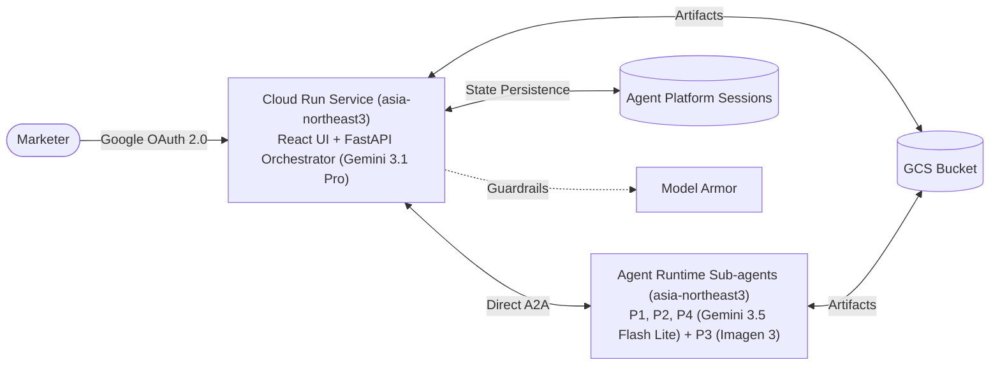

# Technical Design Document: Marketing Value Creator (MVC) v1.0

## 1. Metadata
- **Status**: In Review
- **Stakes tier**: `standard`
- **Sections dropped**: `none`
- **Date last updated**: 2026-08-27
- **Authors**: Ryan Ahn (ryanahn@, Forward Deployed Engineer)
- **Approvers**: Executive Sponsor, FDE Engineering Manager
- **Source repo**: ryanahn-google/mvc

---

## 2. TL;DR
The Marketing Value Creator (MVC) is an enterprise generative AI campaign planning platform built for Nova Electronics Corp to compress manual 4-to-6-week cross-agency marketing workflows into an interactive simulation taking minutes. Built using Google ADK, the system deploys a single-container Cloud Run service in `asia-northeast3` hosting a React Single Page Application (SPA) and a FastAPI Orchestrator (powered by **Gemini 3.1 Pro**).

The Orchestrator coordinates four specialized sub-agents running on Agent Runtime ([P1] Market Sensing, [P2] Strategy & Brief, [P3] Creative Content, [P4] Performance & Insights) via direct Agent-to-Agent (A2A) protocol. Sub-agents P1, P2, and P4 utilize **Gemini 3.5 Flash Lite** targeting Vertex AI `global` endpoints to generate structured JSON artifacts, while P3 leverages **Imagen 3** to produce high-resolution marketing visuals saved to Google Cloud Storage. Marketers inspect intermediate deliverables at each stage through an interactive Web UI secured by **Google OAuth 2.0**, with Human-in-the-Loop (HITL) approval gates backed by Google Agent Platform Sessions.

---

## 3. Background and Context
Today, campaign planning at Nova Electronics Corp is fragmented across regional brand teams, creative agencies, and media planners. Preparing a single multi-channel campaign brief requires weeks of manual desk research, briefing cycles, creative storyboarding, and spreadsheet KPI modeling.

 Previous attempts using standard chat interfaces failed due to context loss, lack of domain specialization, and zero cross-agent coordination. MVC establishes an automated, audit-logged simulation pipeline that generates structured briefs, visual concepts, and defensible budget allocations under strict corporate brand guardrails.

---

## 4. Goals and Non-Goals

### Goals (MVP Scope)
- **Multi-Agent Campaign DAG**: Autonomous sequential execution of Market Sensing $\to$ Strategy & Brief $\to$ Creative Content $\to$ Performance & Insights.
- **Structured Deliverables**: P1, P2, P4 output strictly validated JSON deliverables; P3 generates marketing campaign image files (PNG/JPEG).
- **Interactive HITL Revision Gates**: Marketers can inspect intermediate outputs in real time, submit text feedback for re-generation, or approve progression.
- **Enterprise Security**: Google OAuth 2.0 OIDC authentication on all API requests, Model Armor prompt sanitization, and Direct VPC Egress.
- **Managed Session Persistence**: Resilience against Cloud Run scale-to-zero during marketer review pauses using CloudSQL sessions
- **100% Terraform IaC & ADK Golden Eval**: Complete reproducible deployment in `asia-northeast3` meeting FDE Capstone Rubric standards.

### Non-Goals (Contractual Boundary / Post-MVP)
- **Live Media Buying Transactions**: Automated ad spend execution via DSP/AdTech APIs is strictly out of scope for sandbox.
- **Customer PII Processing**: No real consumer PII; synthetic marketing benchmarks and public trend data only.
- **Legacy ERP/SAP Connectors**: Enterprise system-of-record integration deferred to enterprise rollout.
- **Complex Multi-page Dashboards**: Replaced by a streamlined React single-page console.
- **Non-Google SSO**: Third-party IdPs (Okta, Azure AD, SAML 2.0) excluded; strictly Google OAuth for MVP.

---

## 5. Success Criteria
- **Quality Metric**: Intent classification accuracy $\ge 90\%$ (Gemini 3.1 Pro); Golden eval dataset quality score $\ge 4.0 / 5.0$ (LLM-as-a-Judge); $100\%$ JSON schema compliance for P1, P2, P4.
- **Operational Metric**: Sub-agent text turn latency $< 3.0\text{s}$ (Gemini 3.5 Flash Lite); Image generation $< 8.0\text{s}$ (Imagen 3); Full E2E DAG turnaround $< 15.0\text{s}$ (excluding human pause time); Service availability $99.5\%$.
- **Adoption Metric**: $100\%$ successful end-to-end execution of golden test scenarios (e.g. "Galaxy S27 Black Friday Global Campaign") during final capstone acceptance.

---

## 6. Stakeholders and Roles (RACI)

| Role | Name | RACI | Key Responsibility |
| :--- | :--- | :---: | :--- |
| **FDE Lead / Author** | Ryan Ahn (ryanahn@) | **R** | Primary architecture, development, IaC, and deployment |
| **Tech Lead / Evaluator** | Google Cloud | **A** | Architecture sign-off, rubric assessment |
| **FDE Engineering Manager** | Google Cloud | **A** | Budget allocation & Capstone acceptance |
| **Security Lead / Admin** | Google Cloud | **C** | VPC-SC & IAM permission approval |
| **GBC Marketing Lead** | Executive Sponsor (Nova Electronics) | **C** | Business domain alignment & scenario review |
| **Marketing Operations** | Regional Campaign Planners | **I** | End users of the MVC console |

---

## 7. High-Level Architecture
- **Pattern Name**: Multi-Agent DAG Orchestration with Centralized Orchestrator & Human-in-the-Loop State Engine.
- **Architecture Narrative**:
  The system consists of a single Cloud Run container in `asia-northeast3` serving the React SPA and FastAPI API endpoints. Marketers authenticate via Google OAuth 2.0. The Orchestrator leverages Gemini 3.1 Pro (via Vertex AI `global` endpoint) to coordinate the 4 sub-agents running on Agent Runtime. State transitions and turn history are managed via Agent Platform Sessions, while deliverable files (JSON and PNG/JPEG images) are persisted to a regional GCS bucket. Inbound prompts pass through Model Armor for real-time sanitization.

---

## 8. Detailed Design

### 8.1 Orchestrator Container (Cloud Run)
- **Framework**: FastAPI (Python 3.14) + Google ADK + Uvicorn.
- **Frontend Serving**: Serves compiled React Vite SPA from `/static` mount with custom catch-all route for SPA navigation.
- **Authentication**: OIDC ID token validation middleware verifying Google Identity tokens.
- **Model Armor Middleware**: Inspects user input before forwarding to agents; rejects prompt injection with HTTP 400.
- **HITL Engine**: Implements async pauses on stage completion; streams real-time progress via Server-Sent Events (SSE) `/api/v1/campaigns`.

### 8.2 Sub-Agents (Agent Runtime)
- **[P1] Market Sensing Agent**:
  - Model: `gemini-3.5-flash-lite` (location="global")
  - Task: Synthesize consumer trends, competitive products, market sentiment.
  - Deliverable: `market_sensing.json` saved to GCS.
- **[P2] Strategy & Brief Agent**:
  - Model: `gemini-3.5-flash-lite` (location="global")
  - Task: Formulate target personas, core value proposition, channel messaging mix.
  - Deliverable: `campaign_brief.json` saved to GCS.
- **[P3] Creative Content Agent**:
  - Model: `imagen-3.0-generate-002` + `gemini-3.5-flash-lite` (location="global")
  - Task: Convert strategy brief into visual prompt and generate high-res marketing imagery.
  - Deliverable: `creative_visual.png` (or `.jpg`) saved to GCS.
- **[P4] Performance & Insights Agent**:
  - Model: `gemini-3.5-flash-lite` (location="global")
  - Task: Model budget allocation across channels and forecast simulated ROAS.
  - Deliverable: `performance_insights.json` saved to GCS.
---

## 9. Data Model

### 9.1 Persistent Stores
| Store | Purpose | Schema / Key | Sensitivity | Retention | Encryption |
| :--- | :--- | :--- | :---: | :---: | :---: |
| **GCS Bucket** | Campaign briefs, JSON files, generated PNG/JPEG images | `gs://mvc-artifacts-{project_id}/campaigns/{sessionId}/*` | `internal` | 30 days | Google-managed |
| **Cloud SQL (PostgreSQL 15)** | Multi-turn state, stage pointers, relational campaign metadata, state JSON | `orchestrator_sessions` table (`session_id`, `tenant_id`, `current_stage`, `status`, `state_json`) | `internal` | 30 days | Google-managed |

### 9.2 Deliverable Schemas
- **JSON Schemas (P1, P2, P4)**: Validated via Pydantic models in `src/schemas/`.
- **Image Artifacts (P3)**: Valid binary image files with companion JSON metadata (`promptUsed`, `generationTimestamp`, `resolution`).

---

## 10. API Surface

### 10.1 Public APIs
Formal contract committed at [api/openapi.yaml](../../api/openapi.yaml).

| Endpoint | Method | Auth | Description |
| :--- | :---: | :---: | :--- |
| `/api/v1/campaigns` | `POST` | Google OAuth (Bearer) | Initialize campaign workflow; streams SSE events |
| `/api/v1/campaigns/{sessionId}` | `GET` | Google OAuth (Bearer) | Fetch current session state & artifact URLs |
| `/api/v1/campaigns/{sessionId}/approve` | `POST` | Google OAuth (Bearer) | Submit HITL stage approval or revision feedback |
| `/healthz` | `GET` | None | Container liveness check |
| `/meta` | `GET` | None | Service metadata & model version negotiation |

### 10.2 Consumed APIs
| API | Endpoint Location | Expected QPS | Retry Policy | Failure Behavior |
| :--- | :---: | :---: | :---: | :--- |
| **Vertex AI Gemini API** | `global` | 5.0 QPS | Exponential backoff (max 3 retries) | Fallback to bounded retry, then graceful error |
| **Vertex AI Imagen 3 API** | `global` | 1.0 QPS | 1 retry on 5xx | Return error event to UI |
| **Agent Platform Sessions** | `asia-northeast3` | 5.0 QPS | 3 retries with jitter | Return 500 error envelope |
| **Google Cloud Model Armor** | `global` | 5.0 QPS | Fail-closed policy | Block prompt if service unavailable |

---

## 11. Security and Privacy
- **Key Commitments**:
  - Google OAuth 2.0 OIDC token verification on all user requests.
  - Direct VPC Egress routing internal traffic through `asia-northeast3-subnet`.
  - Model Armor inspection on all prompt inputs (`INSPECT_AND_BLOCK`).
  - The Seven Cost Caps (denial-of-wallet mitigation) preventing recursive loops and runaway token consumption.
  - Least privilege IAM roles for Cloud Run Service Account (`sa-mvc-orchestrator`).

---

## 12. Reliability and SLOs

| SLO Target | Objective | 28-day Error Budget | Kind | Status |
| :--- | :---: | :---: | :---: | :---: |
| **API Availability** | $99.5\%$ | 201.6 min (~3h 22m) | Target | Agreed |
| **Time to First Token (TTFT)** | P95 $\le 2.0\text{s}$ | 5% tail budget | Target | Agreed |
| **Sub-Agent Turn Latency** | P95 $\le 3.0\text{s}$ | 5% tail budget | Target | Agreed |
| **Creative Visual Turn Latency** | P95 $\le 8.0\text{s}$ | 5% tail budget | Target | Agreed |
| **DAG Latency (E2E)** | P95 $\le 15.0\text{s}$ | 5% tail budget | Target | Agreed |
| **Faithfulness (Quality)** | $\ge 0.90$ | 10% tolerance | Target | Agreed |
| **Deterministic Budget Conservation**| $100.0\%$ | Zero tolerance | Target | Agreed |

---

## 13. Cost Model
- **Comprehensive FinOps Specification**: Grounded in live pricing retrieved on 2026-08-26 from `https://ai.google.dev/pricing`.
- **Unit Economics per Campaign Run**:
  - [P1] Market Sensing (`gemini-3.5-flash-lite`): $0.00345
  - [P2] Strategy Brief (`gemini-3.5-flash-lite`): $0.00450
  - [P3] Creative Content (`imagen-4.0-fast-generate-001`): $0.02000 (Dominant lever, 44.0% of task cost)
  - [P4] Performance Insights (`gemini-3.5-flash-lite`): $0.00366
  - Root Orchestrator Coordination (`gemini-3.1-pro-preview`): $0.01360 (29.9% of task cost)
  - Cloud Run & GCS Storage Compute: $0.00029
  - **Total Cost per Campaign Execution**: **$0.0455** (54% below target SLO ceiling of $0.10)
- **Monthly Run Rate**:
  - Baseline MVP (500 runs/month): **$24.80 / month**
  - Enterprise Scale (5,000 runs/month): **$248.00 / month**

---

## 14. Performance & Capacity Sizing
- **Latency Budget (P95 Targets)**:
  - Ingress + Auth: $< 50\text{ms}$
  - Model Armor Check: $< 200\text{ms}$
  - Sub-Agents ([P1], [P2], [P4]): P95 $< 3.0\text{s}$ each
  - Creative Image ([P3]): P95 $< 8.0\text{s}$
  - Total E2E DAG Turnaround: P95 $< 15.0\text{s}$ (excluding human review pauses)
- **Capacity Sizing & Quotas**:
  - Ingress Peak QPS: 0.5 QPS (MVP) / 2.5 QPS (Enterprise Scale)
  - Model API Quotas: Gemini 3.5 Flash Lite (1,000 RPM, 4M TPM) provides $>33\times$ headroom; Gemini 3.1 Pro (360 RPM, 2M TPM) provides $>72\times$ headroom.
  - Cloud Run Sizing: 2 vCPU, 4 GiB RAM, `concurrency = 80`, `min_instances = 0` (scale-to-zero idle pause), `max_instances = 10`.

---

## 15. Observability
<!-- owner: ai-fde-reliability · target: phase 5 -->
- **OpenTelemetry & Cloud Trace**: Distributed tracing propagating `traceId` across Web UI $\to$ Orchestrator $\to$ Agent Runtime $\to$ Vertex AI.
- **Cloud Logging**: Structured JSON logging with user principal, session ID, and sanitized execution status.

---

## 19. Alternatives Considered (Top-Level)

| Alternative | Why it was attractive | Why it lost |
| :--- | :--- | :--- |
| **Separate Cloud Run Services for UI and API** | Decoupled frontend and backend release cycles | Introduced CORS preflight overhead, dual OAuth redirect URIs, and doubled Terraform management complexity for a 1-week MVP |
| **Single Monolithic Prompt Agent** | Simpler code, zero inter-agent network calls | Severe context dilution, inability to perform step-by-step HITL revisions or produce distinct visual assets |
| **Uniform Pro Model Everywhere** | Uniform API interface, maximum reasoning | Exceeded latency budgets ($> 5\text{s}$ per agent turn) and high token consumption without quality benefits on simple extraction |
| **Object Storage Only for Sessions (GCS)** | Serverless zero idle cost during MVP exploration | Lacks relational indexing, SQL filtering by tenant/status/stage, and ACID transactional guarantees; superseded by Cloud SQL PostgreSQL |
| **Custom JWT Username/Password Auth** | No dependency on external Google credentials | High credential storage liability, lack of SSO, and non-compliance with enterprise security standards |
| **Deploying Orchestrator to Agent Runtime** | Unified runtime across all agent components | Agent Runtime cannot serve browser-facing static HTML/JS web assets, handle client-side SPA routing fallbacks, or host custom HTTP middleware (such as Google Identity Services OIDC token decoders and custom SSE event streams) |
| **Multi-Repo Frontend/Backend Separation** | Independent PR pipelines and repository scopes | Triples CI/CD management complexity, makes cross-boundary PRs difficult, and risks silent API contract divergence during rapid MVP development |
| **Fail-Open Policy on Security Inspection** | Maximizes raw availability during security service degradation | Bypassing Model Armor or OAuth token validation exposes the enterprise to prompt injection and unauthorized multi-tenant data exfiltration |