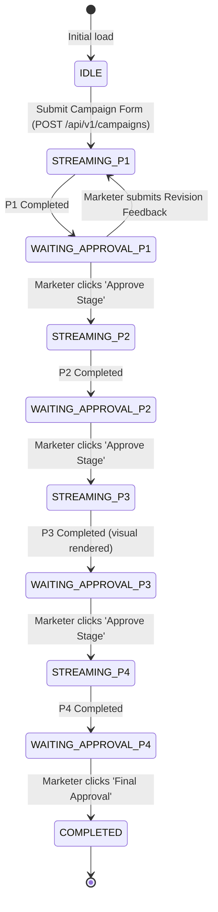

# Frontend Technical Design Document: Marketing Value Creator (MVC)

## 1. Metadata
- **Status**: Approved / In Implementation
- **Version**: 1.0.0
- **Authors**: Ryan Ahn (ryanahn@, Forward Deployed Engineer)
- **Approvers**: Executive Sponsor, FDE Lead
- **Related Documents**: [docs/design/TDD.md](TDD.md), [api/openapi.yaml](../../api/openapi.yaml), [docs/adr/0001-0007](../adr/)
- **Live Staging Endpoint**: `https://version1-797135441724.asia-northeast3.run.app`

---

## 2. Executive Summary & Goals
The Marketing Value Creator (MVC) frontend is an enterprise web application designed for Nova Electronics Corp campaign marketing teams. It transforms a complex 4-stage sequential Multi-Agent DAG into an intuitive, real-time interactive **3-Panel Command Center**. 

### Primary Capabilities:
1. **Interactive Campaign Initialization**: Marketers specify Brand, Product, Target Objective, Budget, and Channel Mix.
2. **Real-Time Streaming Visualizer**: Server-Sent Events (SSE) stream incremental agent thoughts, task progress, and execution milestones across the 4 specialized agents:
   - `[P1] Market Sensing`
   - `[P2] Strategy & Brief`
   - `[P3] Creative Content` (Nano Banana 2 Lite visual synthesis)
   - `[P4] Performance & Insights` (Channel budget allocation & ROAS)
3. **Multimodal Deliverable Inspection**: Rich interactive syntax-highlighted views for structured JSON deliverables, an image gallery lightbox for high-resolution marketing visual assets, and dynamic budget distribution charts.
4. **Human-in-the-Loop (HITL) Governance**: Stage-by-stage review gates where marketers can approve continuation or inject text revision feedback to refine agent outputs.
5. **Contract-First & Zero Drift**: 100% of data structures are type-synchronized with `api/openapi.yaml` via `openapi-typescript`.

---

## 3. Architecture & Topology

### 3.1 Single-Origin Deployment
The frontend is built with React 19, TypeScript, and Vite, compiling into static assets (`frontend/dist/`). The FastAPI backend service (`version1` on Cloud Run in `asia-northeast3`) serves both API routes (`/api/v1/...`, `/run_sse`, `/healthz`) and static UI assets under a single origin:

```mermaid
flowchart LR
    subgraph Client["Web Browser (Marketer)"]
        SPA["React 19 SPA (Vite)"]
    end

    subgraph CloudRun["Cloud Run: version1 (asia-northeast3)"]
        FastAPI["FastAPI Orchestrator (:8000)"]
        StaticEngine["StaticFiles ('/static') & HTML Fallback"]
        APIEngine["Campaign REST & SSE Engine ('/api/v1')"]
        FastAPI --> StaticEngine & APIEngine
    end

    SPA -->|GET / (HTML) & GET /static/* (JS/CSS)| StaticEngine
    SPA -->|POST /api/v1/campaigns (SSE Stream)| APIEngine
    SPA -->|POST /api/v1/campaigns/{id}/approve| APIEngine
```

**Benefits of Single-Origin Topology:**
- **Zero CORS Configuration**: Eliminates preflight latency and browser CORS policy restrictions.
- **Unified Security Boundary**: Shared Google OAuth 2.0 OIDC cookies and authentication headers.
- **Atomic Rollouts**: Frontend bundle and backend orchestrator are containerized together, guaranteeing frontend-backend version parity across Staging and Production.

---

## 4. UI/UX Design System & 3-Panel Command Center

### 4.1 Brand Identity & Color Palette (Nova Electronics Corp)
- **Primary / Brand Accent**: Cobalt Blue (`#2563EB`, `blue-600`) — action buttons, active tabs, progress bars.
- **Deep Background**: Slate Dark Navy (`#0F172A`, `slate-900`) — navigation header, command console.
- **Surface Neutrals**: Neutral Gray (`#F8FAFC`, `slate-50` to `#E2E8F0`, `slate-200`) — clean enterprise card surfaces.
- **Accent Signals**:
  - Emerald Green (`#10B981`): Completed stages, approved deliverables, positive ROAS.
  - Amber Orange (`#F59E0B`): Waiting for Human Review (HITL Gate), warnings.
  - Indigo / Cyan (`#06B6D4`): Active streaming agents, visual generation.
  - Rose Red (`#EF4444`): Model Armor prompt rejection, system errors.

### 4.2 3-Panel Layout Grid
```
+-----------------------------------------------------------------------------------------------------------------------+
|  [Nova Logo] Marketing Value Creator (MVC) v1.0   |  Staging: asia-northeast3  |  Model: Gemini 3.1 Pro + Flash Lite  |
+------------------------------------+------------------------------------+---------------------------------------------+
| PANEL 1: CAMPAIGN CONFIG & HISTORY | PANEL 2: MULTI-AGENT DAG TIMELINE  | PANEL 3: DELIVERABLE INSPECTOR & HITL GATE  |
|                                    |                                    |                                             |
| [Form Inputs]                      | [Stage 1: Market Sensing]          | [Active Stage Deliverable Card]             |
| - Brand Name                       |   * Completed (1.8s)               | - Market Trends (JSON/Cards)                |
| - Product Name                     |                                    | - Competitor Benchmarks                     |
| - Objective                        | [Stage 2: Strategy & Brief]        | - Consumer Sentiment Signal                 |
| - Budget ($)                       |   * Completed (2.1s)               |                                             |
| - Target Channels (Checkboxes)     |                                    | [Visual Concept (Stage 3)]                  |
|                                    | [Stage 3: Creative Content]        | - High-Res Ad Mockup (Lightbox)             |
| [Launch Simulation CTA]            |   * RUNNING (Pulsing Icon)         | - Prompt Metadata Inspector                 |
|                                    |   * Generating visual asset...     |                                             |
| ---------------------------------- |                                    | [Budget Allocation Table (Stage 4)]         |
| [Recent Sessions History]          | [Stage 4: Performance & Insights]  | - Channel Mix %, Simulated ROAS             |
| - Galaxy S27 Black Friday (Done)   |   * Pending                        |                                             |
| - Neo QLED 8K Spring (In Review)   |                                    +---------------------------------------------+
|                                    | [Streaming Thought Log Console]    | [STICKY BOTTOM: HITL ACTION BAR]            |
|                                    | > [P3] Rendering visual prompt...  | [Approve & Continue]  [Request Revision]    |
+------------------------------------+------------------------------------+---------------------------------------------+
```

---

## 5. State Management & Real-Time SSE Streaming

### 5.1 Campaign Workflow State Machine
The UI state transitions through well-defined stages:



### 5.2 Server-Sent Events (SSE) Protocol
The orchestrator streams events as newline-delimited JSON envelopes:
```typescript
interface StreamEvent {
  event: "stage_started" | "stage_chunk" | "stage_completed" | "waiting_approval" | "workflow_completed" | "error";
  data: {
    sessionId: string;
    stage: "market_sensing" | "strategy_brief" | "creative_content" | "performance_insights";
    status: "running" | "waiting_approval" | "completed" | "failed";
    chunk?: string;
    deliverables?: Record<string, unknown>;
    timestamp: string;
    error?: string;
  };
}
```

The custom `useCampaignStream` hook consumes this stream via standard `fetch` and `ReadableStreamDefaultReader`, parsing chunks and automatically updating local component state.

---

## 6. Contract-First API Client (`openapi-typescript`)

To guarantee strict adherence to the API contract and eliminate runtime type errors:
1. `api/openapi.yaml` is the single source of truth.
2. `npm run generate:api` runs:
   ```bash
   npx openapi-typescript ../api/openapi.yaml -o src/api/schema.d.ts
   ```
3. TypeScript exports strongly typed helper interfaces:
   - `CreateCampaignRequest`
   - `CampaignSessionResponse`
   - `ApproveStageRequest`
   - `MarketSensingDeliverable`
   - `CampaignBriefDeliverable`
   - `CreativeContentDeliverable`
   - `PerformanceInsightsDeliverable`

---

## 7. Security & Human-in-the-Loop (HITL) Controls

### 7.1 Google OAuth 2.0 OIDC Authentication
- Requests carry `Authorization: Bearer <ID_TOKEN>` header.
- During local integration mode (`INTEGRATION_TEST=TRUE`), default mock headers are used to allow automated headless testing.

### 7.2 Model Armor Error Feedback
- If a marketer inputs malicious prompts or jailbreaks, the backend returns HTTP 400 with `code: "PROMPT_INJECTION_DETECTED"`.
- The frontend intercepts this response and renders a dedicated Model Armor warning banner advising the marketer to rephrase under Nova Electronics Corp compliance guidelines.

---

## 8. Build, Developer Loop & CI/CD Integration

### 8.1 Makefile Targets
- `make dev-frontend`: Launches Vite local development server on port 5173 with proxy to backend port 8000.
- `make build-frontend`: Typechecks and bundles the application into `frontend/dist/`.

### 8.2 Production Container Packaging (Multi-Stage Dockerfile)
```dockerfile
# Stage 1: Build Frontend Assets
FROM node:24-alpine AS frontend-builder
WORKDIR /build/frontend
COPY frontend/package*.json ./
RUN npm ci
COPY frontend/ ./
COPY api/openapi.yaml /build/api/openapi.yaml
RUN npm run build

# Stage 2: Production Cloud Run Python Service
FROM python:3.13-slim
WORKDIR /code
...
COPY --from=frontend-builder /build/frontend/dist ./frontend/dist
```
