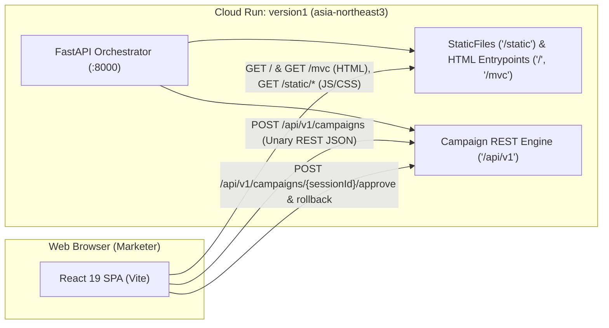
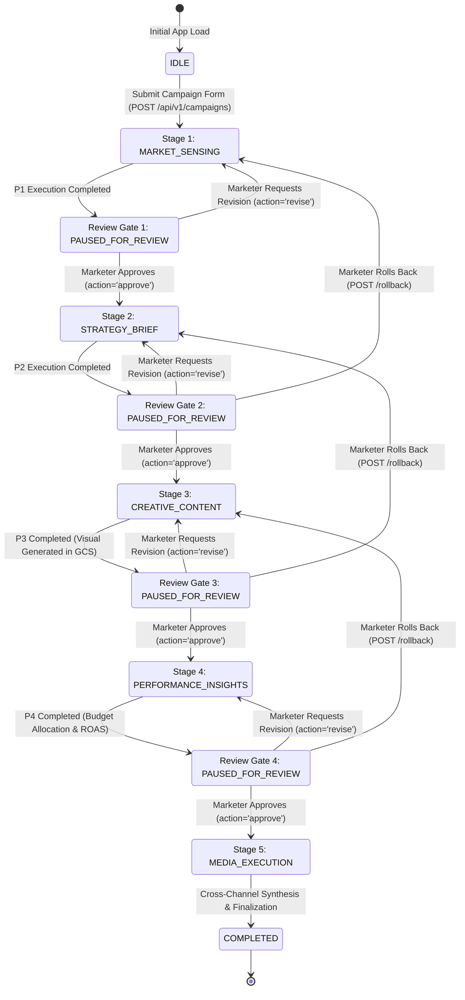

# Frontend Technical Design Document: Marketing Value Creator (MVC)

## 1. Metadata
- **Status**: Approved / In Implementation
- **Version**: 1.0.0
- **Authors**: Ryan Ahn (ryanahn@, Forward Deployed Engineer)
- **Approvers**: Executive Sponsor, FDE Lead
- **Related Documents**: [docs/design/TDD.md](TDD.md), [api/openapi.yaml](../../api/openapi.yaml), [docs/adr/0001-0007](../adr/)
- **Live Staging Endpoint**: `https://version1-797135441724.asia-northeast3.run.app`

---

## 2. Executive Summary & Goals
The Marketing Value Creator (MVC) frontend is an enterprise web application designed for Nova Electronics Corp campaign marketing teams. It transforms a complex 5-stage sequential Multi-Agent DAG into an intuitive, interactive **Multi-View Application Shell** featuring a 5-stage top stepper, active stage canvas, and collapsible assistant/logs panel. 

### Primary Capabilities:
1. **Interactive Campaign Initialization**: Marketers specify Brand, Product, Target Objective, Budget, and Channel Mix (with optional AI prompt parsing via `POST /api/v1/campaigns/parse-prompt`).
2. **State Synchronization & Activity Logging**: Uses synchronous unary REST JSON transactions (`createCampaign`, `approveStage`, `rollbackStage`) with client-side activity stream logging across the 5 specialized stages:
   - `[P1] Market Sensing` (Gemini 3.5 Flash Lite)
   - `[P2] Strategy & Brief` (Gemini 3.5 Flash Lite)
   - `[P3] Creative Content` (Nano Banana 2 Lite / `gemini-3.1-flash-lite-image` visual synthesis)
   - `[P4] Performance & Insights` (Channel budget allocation & ROAS)
   - `[P5] Media Execution & Analytics` (Cross-channel synthesis, execution readiness & PDF export)
   *(Note: The legacy `stream` property on `CampaignCreateRequest` is deprecated and returns `False`; production relies on unary REST).*
3. **Multimodal Deliverable Inspection**: Rich interactive syntax-highlighted views for structured JSON deliverables, an image gallery lightbox for high-resolution marketing visual assets (stored in GCS and served via 307 temporary redirects to V4 signed URLs), and dynamic budget distribution charts.
4. **Human-in-the-Loop (HITL) Governance**: Stage-by-stage review gates where marketers can approve continuation, inject text revision feedback to refine agent outputs, or rollback to preceding stages (`POST /api/v1/campaigns/{sessionId}/rollback`).
5. **Contract-First & Zero Drift**: 100% of data structures are type-synchronized with `api/openapi.yaml` via `openapi-typescript`.

---

## 3. Architecture & Topology

### 3.1 Single-Origin Deployment
The frontend is built with React 19, TypeScript, and Vite, compiling into static assets (`frontend/dist/`). The FastAPI backend service (`app/fast_api_app.py` on Cloud Run in `asia-northeast3`) mounts static UI assets at `/static` (`app.mount("/static", StaticFiles(directory=str(STATIC_DIR), html=True), name="static")`) aligned with Vite's configured `base: '/static/'`. The backend serves the compiled SPA `index.html` at both `GET /` and `GET /mvc` entrypoints (`app/routers/system.py`), alongside modular API routes (`/api/v1/...`, `/healthz`, `/meta`):



**Benefits of Single-Origin Topology:**
- **Zero CORS Configuration**: Eliminates preflight latency and browser CORS policy restrictions.
- **Unified Security Boundary**: Shared Google OAuth 2.0 OIDC cookies and authentication headers.
- **Atomic Rollouts**: Frontend bundle and backend orchestrator are containerized together, guaranteeing frontend-backend version parity across Staging and Production.

---

## 4. UI/UX Design System & Multi-View Application Shell

### 4.1 Brand Identity & Color Palette (Nova Electronics Corp)
- **Primary / Brand Accent**: Cobalt Blue (`#2563EB`, `blue-600`) — action buttons, active tabs, progress bars.
- **Deep Background**: Slate Dark Navy (`#0F172A`, `slate-900`) — navigation header, command console.
- **Surface Neutrals**: Neutral Gray (`#F8FAFC`, `slate-50` to `#E2E8F0`, `slate-200`) — clean enterprise card surfaces.
- **Accent Signals**:
  - Emerald Green (`#10B981`): Completed stages, approved deliverables, positive ROAS.
  - Amber Orange (`#F59E0B`): Waiting for Human Review (HITL Gate), warnings.
  - Indigo / Cyan (`#06B6D4`): Active stage agents, visual generation.
  - Rose Red (`#EF4444`): Model Armor prompt rejection, system errors.

### 4.2 Application Shell & Layout Architecture
The frontend architecture (`App.tsx`) is implemented as a multi-view application shell rather than a rigid horizontal grid:
1. **Global Dark Navy Sidebar (`Sidebar.tsx`)**: Collapsible navigation bar providing view switching:
   - `HOME`: `HomeDashboard.tsx` — Campaign portfolio list, recent session status, and quick simulation starter cards.
   - `WORKSPACE`: `CampaignWorkspace.tsx` — Primary multi-agent execution canvas and review cockpit.
   - `ASSETS`: `AssetLibraryView.tsx` — Visual media gallery and downloadable deliverable archive.
   - `SETTINGS`: `SettingsView.tsx` — System metadata, model inventory, and environment diagnostics.
2. **Top Header Bar (`TopHeader.tsx`)**: Displays active campaign title, status badge (`INITIALIZING`, `RUNNING`, `PAUSED_FOR_REVIEW`, `COMPLETED`, `FAILED`), language switcher (`ko` / `en`), and authenticated user profile.
3. **Model Armor Guardrail Security Alert Banner (`App.tsx`)**: Dismissible top banner triggered when user prompts are rejected by enterprise safety templates with `PROMPT_INJECTION_DETECTED` (HTTP 400).
4. **Workspace Multi-Agent Cockpit (`CampaignWorkspace.tsx`)**:
   - **Top 5-Stage Stepper Bar**: Linear progression tracker displaying status and duration:
     - Step 1: Market Sensing (`MARKET_SENSING`)
     - Step 2: Strategy Brief (`STRATEGY_BRIEF`)
     - Step 3: Creative Content (`CREATIVE_CONTENT`)
     - Step 4: Performance & Insights (`PERFORMANCE_INSIGHTS`)
     - Step 5: Media Execution & Analytics (`MEDIA_EXECUTION` / `COMPLETED`)
   - **Main Active Stage Canvas (Center/Left)**: Contextually mounts the active stage view:
     - `MarketSensingView.tsx`: Campaign initiation form, trend intelligence cards, competitor benchmark signals.
     - `StrategyBriefView.tsx`: Strategic target audience pillars, core value propositions, channel messaging themes.
     - `ContentView.tsx`: High-resolution marketing visual mockups (via GCS signed URLs), prompt metadata inspector, and image revision controls.
     - `MediaPlanMmmView.tsx`: Channel budget allocation matrix (100% exact sum), MMM spend sliders, simulated ROAS curves.
     - `ExecutionAndAnalyticsView.tsx`: Final multi-channel rollout schedule, synthesis metrics, and executive PDF summary export.
   - **Collapsible Right Assistant & Logs Panel (`AssistantAndLogsPanel.tsx`)**: Real-time activity log stream, agent execution milestones, and conversational assistant.
   - **HITL Revision Modal (`RevisionModal.tsx`)**: Structured modal dialogue allowing marketers to provide targeted text feedback or edit deliverable fields before advancing.

```
+-----------------------------------------------------------------------------------------------------------------------+
|  [Sidebar]  |  [Nova Logo] Marketing Value Creator (MVC) v1.0   |  Status: PAUSED_FOR_REVIEW  |  Lang: KO/EN  | [User] |
+-------------+---------------------------------------------------------------------------------------------------------+
| [NAV]       | TOP 5-STAGE STEPPER BAR:                                                                                |
| - HOME      | (1) Market Sensing -> (2) Strategy Brief -> [3] Creative Content -> (4) Perf Insights -> (5) Execution   |
| - WORKSPACE +-------------------------------------------------------------------+-------------------------------------+
| - ASSETS    | MAIN ACTIVE STAGE CANVAS (Center/Left)                            | COLLAPSIBLE RIGHT PANEL             |
| - SETTINGS  |                                                                   | (AssistantAndLogsPanel.tsx)         |
|             | [Active Stage: CREATIVE_CONTENT]                                  |                                     |
|             | +---------------------------------------------------------------+ | [Execution Logs & Agent Thoughts]   |
|             | | High-Resolution Ad Mockup Preview (GCS Signed URL)            | | > [P3] Prompt verified.           |
|             | | [ Image Lightbox / Visual Deliverable Preview ]               | | > [P3] Visual synthesis complete. |
|             | +---------------------------------------------------------------+ | > Session: mvc-20260901-abcd        |
|             | | Prompt Inspector: "Futuristic Galaxy S27 Hologram Display..." | |                                     |
|             | +---------------------------------------------------------------+ | [Assistant Chat Input]              |
|             |                                                                   | "Ask about channel allocation..."   |
|             | [STAGE ACTION CONTROLS]                                           |                                     |
|             | [<- Rollback to Step 2]    [Request Revision]    [Approve Step 3] |                                     |
+-------------+-------------------------------------------------------------------+-------------------------------------+
```

### 4.3 Asynchronous Visual Asset Polling in Stage 3 (ContentView)
To eliminate perceived latency when advancing to Stage 3 or revising creative content:
- **Synchronous Copy & Immediate Render**: Step 3a text copywriting (headline, body copy, CTA, visual concept) returns synchronously in sub-2 seconds, immediately mounting `ContentView.tsx` in `PAUSED_FOR_REVIEW`.
- **Background Visual Synthesis & Skeleton Loader**: Step 3b image synthesis via Nano Banana 2 Lite runs asynchronously in the background. While `assetUrl` is absent, `ContentView.tsx` renders an animated visual skeleton loader indicating background rendering.
- **Client-Side Polling**: An automated polling loop checks `apiClient.getSession(sessionId)` at 2.5s intervals (up to 25 attempts / ~60s) until `deliverables.creativeContent.assetUrl` is populated, automatically displaying the high-resolution marketing asset without requiring user refresh.

---

## 5. State Management & Workflow Execution

### 5.1 Campaign Workflow State Machine
The UI state transitions through well-defined stages across the 5-step DAG, supporting iterative human feedback (`action='revise'`) and stage rewind (`rollbackStage`):



### 5.2 Unary REST State Synchronization & Activity Logging
While Server-Sent Events (SSE) was initially considered in early prototypes, production MVC is architected on **deterministic unary REST JSON transactions** returning `CampaignSessionResponse`.

#### Architecture Rationale & Implementation:
1. **Deterministic Transactions**: Campaign initialization (`apiClient.createCampaign`), stage advancement (`apiClient.approveStage`), and stage rollback (`apiClient.rollbackStage`) are discrete HTTP requests that atomically transition the database session state (`orchestrator_sessions` in Cloud SQL).
2. **Deprecated `stream` Property**: The backend schema in `app/schemas/campaign.py` explicitly marks `stream` as a deprecated backwards-compatibility property returning `False`:
   ```python
   @property
   def stream(self) -> bool:
       """Deprecated backwards-compatibility accessor."""
       return False
   ```
3. **Synthetic Client-Side Activity Logging**: The custom hook `useCampaignStream.ts` manages simulation UI state and synthesizes real-time activity logs client-side via `addLog(message, level, stage)`. As async REST calls execute, the hook appends connection milestones, sub-agent handoffs, and review gate alerts to the log console:
   ```typescript
   // frontend/src/hooks/useCampaignStream.ts
   addLog('Connecting to [P1] Market Sensing Agent (Gemini 3.5 Flash Lite)...', 'info', 'MARKET_SENSING');
   const initialSession = await apiClient.createCampaign(req);
   setSession(initialSession);
   addLog(`Session created: ${initialSession.sessionId}`, 'success');
   addLog(`[P1] Market Sensing synthesis completed.`, 'success', 'MARKET_SENSING');
   ```
4. **Session Resumption & State Recovery**: Marketers can pause between review stages for hours or days. Calling `apiClient.getSession(sessionId)` fetches the latest persisted state from `GET /api/v1/campaigns/{sessionId}`, enabling seamless resumption across Cloud Run scale-to-zero events.

---

## 6. Contract-First API Client (`openapi-typescript`)

To guarantee strict adherence to the API contract and eliminate runtime type errors:
1. `api/openapi.yaml` is the single source of truth.
2. `npm run generate:api` runs:
   ```bash
   npx openapi-typescript ../api/openapi.yaml -o src/api/schema.d.ts
   ```
3. TypeScript exports strongly typed helper interfaces from `src/types/campaign.ts`:
   - `CreateCampaignRequest`
   - `CampaignSessionResponse`
   - `StageApprovalRequest` (corrected from legacy `ApproveStageRequest`)
   - `MarketSensingDeliverable`
   - `CampaignBriefDeliverable`
   - `CreativeContentDeliverable`
   - `PerformanceInsightsDeliverable`
   - `ParsePromptRequest` / `ParsePromptResponse`
   - `GoogleAuthRequest` / `DevLoginRequest` / `UserProfileResponse`

4. Canonical API client methods implemented in `src/api/client.ts` using `{sessionId}` route parameters:
   - `createCampaign(req: CreateCampaignRequest)`: `POST /api/v1/campaigns`
   - `getSession(sessionId: string)`: `GET /api/v1/campaigns/{sessionId}`
   - `approveStage(sessionId: string, req: StageApprovalRequest)`: `POST /api/v1/campaigns/{sessionId}/approve`
   - `rollbackStage(sessionId: string)`: `POST /api/v1/campaigns/{sessionId}/rollback`
   - `updateSessionDeliverables(sessionId: string, deliverables)`: `PATCH /api/v1/campaigns/{sessionId}`
   - `parsePrompt(req: ParsePromptRequest)`: `POST /api/v1/campaigns/parse-prompt`
   - `listUserCampaigns()`: `GET /api/v1/campaigns`
   - `loginWithGoogle(credential: string)`: `POST /api/v1/auth/google`
   - `devLogin(email?: string, name?: string)`: `POST /api/v1/auth/dev-login`
   - `getCurrentUser()`: `GET /api/v1/auth/me`
   - `logout()`: `POST /api/v1/auth/logout`
   - `getMeta()`: `GET /meta`

---

## 7. Security & Human-in-the-Loop (HITL) Controls

### 7.1 Google OAuth 2.0 OIDC Authentication
- Requests carry `Authorization: Bearer <ID_TOKEN>` header.
- During local integration mode (`INTEGRATION_TEST=TRUE`), default mock headers are used to allow automated headless testing.

### 7.2 Model Armor Error Feedback
- If a marketer inputs malicious prompts or jailbreaks, the backend returns HTTP 400 with `code: "PROMPT_INJECTION_DETECTED"`.
- The frontend intercepts this response and renders a dedicated Model Armor warning banner advising the marketer to rephrase under Nova Electronics Corp compliance guidelines.

---

## 8. Build, Developer Loop & CI/CD Integration

### 8.1 Makefile Targets
- `make dev-frontend`: Launches Vite local development server on port 5173 with proxy to backend port 8000.
- `make build-frontend`: Typechecks and bundles the application into `frontend/dist/`.

### 8.2 Production Container Packaging (Multi-Stage Dockerfile)
```dockerfile
# Stage 1: Build Frontend Assets
FROM node:24-alpine AS frontend-builder
WORKDIR /build/frontend
COPY frontend/package*.json ./
RUN npm ci
COPY frontend/ ./
COPY api/openapi.yaml /build/api/openapi.yaml
RUN npm run build

# Stage 2: Production Cloud Run Python Service
FROM python:3.13-slim
WORKDIR /code
...
COPY --from=frontend-builder /build/frontend/dist ./frontend/dist
```
