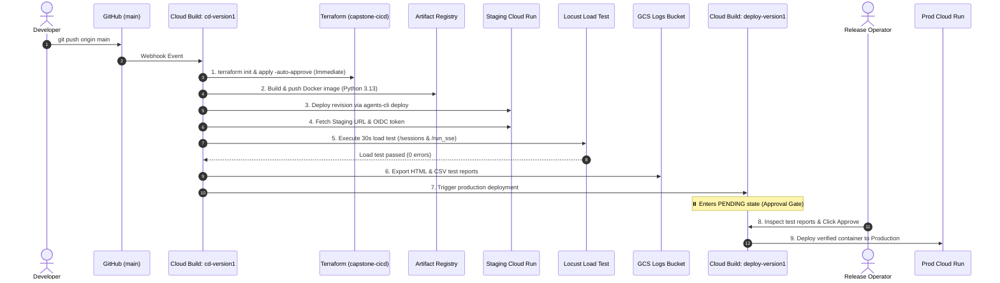

# Technical Design Document: Marketing Value Creator (MVC) v1.0

## 1. Metadata
- **Status**: Approved / Production Deployed (Staging Verified, Prod Awaiting Approval)
- **Stakes tier**: `standard`
- **Sections dropped**: `none (SRE burn-rate alerts, standalone RELIABILITY.md, CHANGES.md, LINEAGE.md, and FINOPS.md are intentionally consolidated into §§11–15 per project architecture directives)`
- **Date last updated**: 2026-08-30
- **Authors**: Ryan Ahn (ryanahn@, Forward Deployed Engineer)
- **Approvers**: Executive Sponsor, FDE Engineering Manager
- **Source repo**: ryanahn-google/version1
- **ADR registry**: [docs/adr/README.md](../adr/README.md)
- **Eval plan**: [docs/EVAL.md](../EVAL.md)
- **Live Staging Endpoint**: `https://version1-797135441724.asia-northeast3.run.app`

---

## 2. TL;DR
The Marketing Value Creator (MVC) is an enterprise generative AI campaign planning platform built for Nova Electronics Corp to compress manual 4-to-6-week cross-agency marketing workflows into an interactive simulation taking minutes. Built using Google ADK and FastAPI, the system deploys a containerized Cloud Run service (`version1`) in `asia-northeast3` hosting a React Single Page Application (SPA) and an Orchestration Engine (powered by **Gemini 3.1 Pro**).

The Orchestrator coordinates four specialized sub-agents running on Vertex AI Agent Runtime / Reasoning Engine ([P1] Market Sensing, [P2] Strategy & Brief, [P3] Creative Content, [P4] Performance & Insights) via direct Agent-to-Agent (A2A) protocol. Sub-agents P1, P2, and P4 utilize **Gemini 3.5 Flash Lite** targeting Vertex AI `global` endpoints to generate structured JSON artifacts, while P3 leverages **Nano Banana 2 Lite** (`gemini-3.1-flash-lite-image`) to produce high-resolution marketing visuals saved to Google Cloud Storage.

Marketers inspect intermediate deliverables at each stage through an interactive Web UI secured by **Google OAuth 2.0 OIDC**, with Human-in-the-Loop (HITL) approval gates. Campaign workflow states, deliverables, and ADK session histories are persisted in **Google Cloud SQL (PostgreSQL 15)** mounted securely over Cloud SQL Auth Proxy Unix domain sockets, preventing public database exposure. The entire system is governed across 3 dedicated GCP projects (`capstone-cicd`, `capstone-staging-506811`, `capstone-prod-506811`) using 100% Terraform Infrastructure-as-Code and automated Cloud Build CI/CD with Locust load-test validation and a native Production Approval Gate.

---

## 3. Background and Context
Today, campaign planning at Nova Electronics Corp is fragmented across regional brand teams, creative agencies, and media planners. Preparing a single multi-channel campaign brief requires weeks of manual desk research, briefing cycles, creative storyboarding, and spreadsheet KPI modeling.

Previous attempts using standard chat interfaces failed due to context loss, lack of domain specialization, and zero cross-agent coordination. MVC establishes an automated, audit-logged simulation pipeline that generates structured briefs, visual concepts, and defensible budget allocations under strict corporate brand guardrails.

---

## 4. Goals and Non-Goals

### Goals (MVP & Production Scope)
- **Multi-Agent Campaign DAG**: Autonomous sequential execution of Market Sensing $\to$ Strategy & Brief $\to$ Creative Content $\to$ Performance & Insights.
- **Structured Deliverables**: P1, P2, P4 output strictly validated JSON deliverables; P3 generates marketing campaign image files (PNG/JPEG).
- **Interactive HITL Revision Gates**: Marketers can inspect intermediate outputs in real time, submit text feedback for re-generation, or approve progression.
- **Enterprise Security**: Google OAuth 2.0 OIDC authentication on all API requests, Google Cloud Model Armor prompt sanitization, Direct VPC Egress (`asia-northeast3-subnet`), and Cloud SQL Auth Proxy socket connectivity.
- **Managed Dual-Layer Session Persistence**: Resilience against Cloud Run scale-to-zero during marketer review pauses using Cloud SQL PostgreSQL 15 storing both ADK chat sessions and campaign orchestrator deliverable models.
- **100% Terraform IaC & Automated CI/CD**: Fully reproducible deployment across 3 GCP projects with Cloud Build automated PR testing, Staging auto-deployment, automated Locust load test gate, and a manual Production Approval Gate.

### Non-Goals (Contractual Boundary / Post-MVP)
- **Live Media Buying Transactions**: Automated ad spend execution via DSP/AdTech APIs is strictly out of scope for sandbox.
- **Customer PII Processing**: No real consumer PII; synthetic marketing benchmarks and public trend data only.
- **Legacy ERP/SAP Connectors**: Enterprise system-of-record integration deferred to enterprise rollout.
- **Complex Multi-page Dashboards**: Replaced by a streamlined React single-page console.
- **Non-Google SSO**: Third-party IdPs (Okta, Azure AD, SAML 2.0) excluded; strictly Google OAuth for MVP.

---

## 5. Success Criteria
- **Quality Metric**: Intent classification accuracy $\ge 90\%$ (Gemini 3.1 Pro); Golden eval dataset quality score $\ge 4.0 / 5.0$ (LLM-as-a-Judge); $100\%$ JSON schema compliance for P1, P2, P4.
- **Operational Metric**: Sub-agent text turn latency $< 3.0\text{s}$ (Gemini 3.5 Flash Lite); Image generation $< 8.0\text{s}$ (Nano Banana 2 Lite); Full E2E DAG turnaround $< 15.0\text{s}$ (excluding human pause time); Service availability $99.5\%$.
- **Verification Metric**: $100\%$ pass rate on automated Locust load test (sessions & SSE streaming) executed in Cloud Build prior to production promotion gate.
- **Adoption Metric**: $100\%$ successful end-to-end execution of golden test scenarios (e.g. "Galaxy S27 Black Friday Global Campaign") during final capstone acceptance.
- **Eval Plan**: Detailed evaluation dataset schema, multi-turn metrics, and judge calibration documented in [docs/EVAL.md](../EVAL.md).

---

## 6. Stakeholders and Roles (RACI)

| Role | Name | RACI | Key Responsibility |
| :--- | :--- | :---: | :--- |
| **FDE Lead / Author** | Ryan Ahn (ryanahn@) | **R** | Primary architecture, development, IaC, CI/CD, and deployment |
| **Tech Lead / Evaluator** | Google Cloud | **A** | Architecture sign-off, rubric assessment |
| **FDE Engineering Manager** | Google Cloud | **A** | Budget allocation & Capstone acceptance |
| **Security Lead / Admin** | Google Cloud | **C** | VPC, Model Armor, & IAM permission approval |
| **GBC Marketing Lead** | Executive Sponsor (Nova Electronics) | **C** | Business domain alignment & scenario review |
| **Marketing Operations** | Regional Campaign Planners | **I** | End users of the MVC console |

---

## 7. High-Level Architecture
- **Pattern Name**: Multi-Agent DAG Orchestration with Centralized Orchestrator, Vertex AI Agent Runtime, and Multi-Project CI/CD.
- **Architecture Topology**:

```mermaid
flowchart TB
    subgraph CI_CD["CI/CD Runner Project: capstone-cicd"]
        GitHub["GitHub Repo<br>ryanahn-google/version1"] -->|Webhook| CB_PR["Cloud Build: pr-version1<br>(Unit & Integration Tests)"]
        GitHub -->|Push main| CB_Staging["Cloud Build: cd-version1<br>(Docker Build & Staging Deploy)"]
        CB_Staging --> AR["Artifact Registry<br>version1-repo (Seoul)"]
        CB_Staging --> Locust["Locust Load Test (30s)<br>Headless Verification"]
        Locust -->|Success| CB_Prod["Cloud Build: deploy-version1<br>⏸️ Approval Gate (PENDING)"]
    end

    subgraph Staging_Env["Staging Project: capstone-staging-506811"]
        CR_Staging["Cloud Run: version1 (2 vCPU, 4GiB)<br>FastAPI + React SPA"]
        VPC_Staging["VPC: version1-vpc<br>Subnet: asia-northeast3-subnet (10.10.0.0/24)"]
        NAT_Staging["Cloud NAT: version1-nat"]
        SQL_Staging[("Cloud SQL: version1-db-staging<br>PostgreSQL 15")]
        GCS_Staging[("GCS: version1-logs & artifacts")]
        Armor_Staging["Model Armor: version1-guardrails"]
        BQ_Staging[("BigQuery: genai_telemetry")]
        
        CR_Staging -->|Direct VPC Egress| VPC_Staging --> NAT_Staging
        CR_Staging -->|Auth Proxy Socket /cloudsql| SQL_Staging
        CR_Staging --> GCS_Staging
        CR_Staging -.-> BQ_Staging
        CR_Staging -.->|Prompt & Response Sanitization| Armor_Staging
    end

    subgraph Agent_Runtime["Vertex AI Agent Runtime (Reasoning Engine)"]
        P1["[P1] Market Sensing<br>gemini-3.5-flash-lite"]
        P2["[P2] Strategy & Brief<br>gemini-3.5-flash-lite"]
        P3["[P3] Creative Content<br>flash-lite-image + flash-lite"]
        P4["[P4] Performance Insights<br>gemini-3.5-flash-lite"]
    end

    CB_Staging -->|agents-cli deploy| CR_Staging
    CR_Staging <-->|A2A Direct Ingress (Agent Identity)| P1 & P2 & P3 & P4
    CB_Prod -->|Manual Approval| CR_Prod["Production Cloud Run: version1<br>(capstone-prod-506811)"]
```

---

## 8. Detailed Design

### 8.1 Orchestrator Container (Cloud Run)
- **Service Name**: `version1`
- **Framework**: FastAPI (Python 3.13) + Google ADK + Uvicorn.
- **Compute Sizing**: 2 vCPU, 4 GiB RAM, `concurrency = 80`, `min_instances = 0` (scale-to-zero), `max_instances = 10`, `cpu_idle = false`.
- **Frontend Serving**: Mounts pre-compiled React Vite SPA from `/static` mount with custom catch-all route for client-side routing.
- **Authentication**: OIDC ID token validation middleware verifying Google Identity tokens.
- **Model Armor Middleware**: Inspects user input before forwarding to agents using regional template `version1-guardrails` configured with Sensitive Data Protection (SDP) basic enforcement (`filter_enforcement = "ENABLED"`) to prevent PII leakage. Advanced prompt injection and jailbreak filter modules are intentionally deferred in infrastructure to prevent false positives on marketing brief copy and minimize TTFT inspection latency overhead; prompt boundaries and sanitization are enforced defensively at the application layer via ADK system instructions and Pydantic validation schemas.
- **HITL Engine**: Implements async pauses on stage completion; streams real-time progress via Server-Sent Events (SSE) `/api/v1/campaigns`.

### 8.2 Sub-Agents on Vertex AI Reasoning Engine (Agent Runtime)
Sub-agents are provisioned as independent Reasoning Engine instances via Terraform (`google_vertex_ai_reasoning_engine.subagents`), configured with:
- **Framework**: `google-adk`
- **Resource Limits**: 1 vCPU, 4 GiB RAM, `container_concurrency = 8`.
- **Auto-scaling**: `min_instances = 0`, `max_instances = 5`.
- **Subagent Matrix**:
  1. **[P1] Market Sensing Agent**:
     - Model: `gemini-3.5-flash-lite` (location="global")
     - Task: Synthesize consumer trends, competitive products, market sentiment.
     - Deliverable: `MarketSensingDeliverable` (JSON)
  2. **[P2] Strategy & Brief Agent**:
     - Model: `gemini-3.5-flash-lite` (location="global")
     - Task: Formulate target personas, core value proposition, channel messaging mix.
     - Deliverable: `CampaignBriefDeliverable` (JSON)
  3. **[P3] Creative Content Agent**:
     - Model: `gemini-3.1-flash-lite-image` (Nano Banana 2 Lite) + `gemini-3.5-flash-lite` (location="global")
     - Pipeline: Self-contained sequential generation within the `creative_content` subagent:
       - *Step 3a (Prompt Translation & Copy)*: `gemini-3.5-flash-lite` synthesizes headline, body copy, CTA, and studio-grade 16:9 photographic prompt.
       - *Step 3b (Visual Asset Synthesis)*: `gemini-3.1-flash-lite-image` (Nano Banana 2 Lite) renders 16:9 marketing visual binary via native `generate_content`.
       - *Step 3c (Cloud Storage Persistence)*: Subagent uploads marketing visuals exclusively to GCS (`gs://{project_id}-version1-artifacts/campaigns/{session_id}/`); never persists to local container disk. Visual deliverables are accessed directly from Cloud Storage.
     - Deliverable: `CreativeContentDeliverable` (PNG/JPEG image URL + prompt metadata)
  4. **[P4] Performance & Insights Agent**:
     - Model: `gemini-3.5-flash-lite` (location="global")
     - Task: Model budget allocation across channels and forecast simulated ROAS, evaluating the creative visual concept and asset URL generated by P3 for CTR and conversion impact.
     - Deliverable: `PerformanceInsightsDeliverable` (JSON including `creativeAssetUrl` and `visualConceptSummary`)
- **A2A Ingress**: Each subagent exposes a REST/JSON-RPC A2A endpoint whose URL is injected into Cloud Run environment variables (`A2A_P1_URL`, `A2A_P2_URL`, `A2A_P3_URL`, `A2A_P4_URL`).
- **Direct A2A Ingress & Model Armor Guardrails**: Subagents are deployed with SPIFFE-based Agent Identity (`--enable-agent-identity`) via `scripts/deploy_subagents.sh`. Inbound prompts and outbound deliverables are governed through defense-in-depth Model Armor inspection (`app/orchestrator/security.py`) connected to regional templates (`version1-guardrails`) in `asia-northeast3` ensuring Sensitive Data Protection (SDP) without cross-region latency overhead.
- **Dedicated Subagent Identity & Delegation**: Deployed with `--service-account=version1-subagent@{project_id}.iam.gserviceaccount.com` (`service_accounts.tf`) bound to `roles/storage.objectAdmin`, `roles/aiplatform.user`, `roles/logging.logWriter`, `roles/cloudtrace.agent`, and `roles/serviceusage.serviceUsageConsumer`. The Vertex AI Reasoning Engine service agent (`service-${project_number}@gcp-sa-aiplatform.iam.gserviceaccount.com`) is granted `roles/iam.serviceAccountUser` and `roles/iam.serviceAccountTokenCreator` on `version1-subagent` (retargeted from `app_sa`), enabling subagents on Agent Runtime to execute and write visual deliverables directly to GCS while complying with least-privilege IAM.

### 8.3 CI/CD & Multi-Project Topology
The deployment pipeline spans three dedicated GCP projects:
1. **`capstone-cicd`**: Central runner hosting GitHub App connection (`git-version1`), shared Artifact Registry (`version1-repo`), and Cloud Build triggers.
2. **`capstone-staging-506811`**: Staging environment where automated image builds, deployments, and Locust load tests execute.
3. **`capstone-prod-506811`**: Production environment protected by a manual approval gate.

*Note on Single-Project Starter Template*: The `deployment/terraform/single-project/` directory is retained solely as an unmaintained starter-pack reference for single-project bootstrap experiments. The canonical, enterprise multi-environment infrastructure is exclusively implemented in `deployment/terraform/cicd/`. Full remediation (e.g. multi-project isolation, automated approval gates, Reasoning Engine subagent delegation) is intentionally omitted from `single-project/` by design.

---

## 9. Data Model & Persistent Stores

### 9.1 Persistent Stores Matrix
| Store | Purpose | Schema / Key | Retention | Encryption | Connection Method |
| :--- | :--- | :--- | :---: | :---: | :--- |
| **Cloud SQL (PostgreSQL 15)** | Relational campaign state, deliverables JSON, and ADK multi-turn chat sessions | `orchestrator_sessions`, `sessions`, `events`, `user_states`, `app_states` | 7 days (automated backup default; `deletion_protection=false`) | Google-managed | Cloud SQL Auth Proxy Unix domain socket (`/cloudsql/{instance}`) via IAM + mTLS *(Local: SQLite `sqlite+aiosqlite`)* |
| **GCS Logs Bucket** | Build logs, Locust HTML/CSV reports, OpenTelemetry JSONL completion hooks | `gs://{project_id}-version1-logs/*` | 30 days | Google-managed | Google Cloud Storage API *(Local: Console / local file)* |
| **GCS Artifacts Bucket**| Generated PNG/JPEG marketing assets and serialized deliverables | `gs://{project_id}-version1-artifacts/*` | 30 days | Google-managed | GCS API; direct HTTPS / GCS authenticated access |
| **Artifact Registry** | Container image repository for Cloud Run | `asia-northeast3-docker.pkg.dev/capstone-cicd/version1-repo/version1` | Tagged by `$SHORT_SHA` | Google-managed | HTTPS / IAM |

*Note on Cloud SQL Retention & Deletion Protection*: Cloud SQL instances (`version1-db-staging`, `version1-db-prod`) intentionally utilize Google Cloud SQL's default 7-day automated backup retention without extended 30-day retention, and set `deletion_protection = false` across all environments. This design choice optimizes for developer agility, rapid testing, and clean Terraform teardowns in sandbox environments. Durable business artifacts (generated marketing visuals and JSON deliverables) are independently archived with 30-day retention in Google Cloud Storage (`gs://{project_id}-version1-artifacts/`).

### 9.2 Cloud SQL Relational Schemas (`version1` Database)
- **`campaign_sessions` Table**:
  ```sql
  CREATE TABLE campaign_sessions (
      session_id VARCHAR(64) PRIMARY KEY,
      user_id VARCHAR(64),
      tenant_id VARCHAR(64) NOT NULL DEFAULT 'default',
      status VARCHAR(32) NOT NULL,
      current_stage VARCHAR(32) NOT NULL,
      brand_name VARCHAR(128) NOT NULL,
      product_name VARCHAR(128) NOT NULL,
      campaign_objective TEXT NOT NULL,
      budget_amount FLOAT NOT NULL,
      currency VARCHAR(16) NOT NULL DEFAULT 'USD',
      channels JSON NOT NULL,
      deliverables JSON NOT NULL,
      revision_count INT NOT NULL DEFAULT 0,
      created_at TIMESTAMP NOT NULL,
      updated_at TIMESTAMP NOT NULL
  );
  ```
- **`user_sessions` Table (OIDC Cookie Session Store)**:
  ```sql
  CREATE TABLE user_sessions (
      session_token VARCHAR(128) PRIMARY KEY,
      user_id VARCHAR(64) NOT NULL,
      ip_address VARCHAR(45),
      user_agent TEXT,
      expires_at TIMESTAMP NOT NULL,
      created_at TIMESTAMP NOT NULL,
      last_accessed_at TIMESTAMP NOT NULL
  );
  ```
- **`users` Table (Google OAuth Marketer Identity)**:
  ```sql
  CREATE TABLE users (
      user_id VARCHAR(64) PRIMARY KEY,
      google_sub VARCHAR(64) UNIQUE,
      email VARCHAR(255) UNIQUE NOT NULL,
      name VARCHAR(255) NOT NULL,
      picture TEXT,
      role VARCHAR(32) NOT NULL DEFAULT 'MARKETER',
      tenant_id VARCHAR(64) NOT NULL DEFAULT 'default',
      is_active BOOLEAN NOT NULL DEFAULT TRUE,
      created_at TIMESTAMP NOT NULL,
      updated_at TIMESTAMP NOT NULL,
      last_login_at TIMESTAMP NOT NULL
  );
  ```
- **Google ADK Sessions Schema**:
  - `sessions`: User ID, App Name, Session ID, Update Time.
  - `events`: Individual turn events, user prompts, agent author (`strategy_brief_agent`, etc.), and model parts.
  - `user_states` / `app_states`: Serialized session context dictionaries.

---

## 10. API Surface

### 10.1 Orchestrator API Endpoints
| Endpoint | Method | Auth | Description |
| :--- | :---: | :---: | :--- |
| `/api/v1/campaigns` | `POST` | Google OAuth (Bearer) / Session Cookie | Initialize campaign workflow; streams SSE events |
| `/api/v1/campaigns` | `GET` | Google OAuth (Bearer) / Session Cookie | List recent campaign sessions owned by authenticated user |
| `/api/v1/campaigns/{sessionId}` | `GET` | Google OAuth (Bearer) / Session Cookie | Fetch current session state & artifact URLs from Cloud SQL |
| `/api/v1/campaigns/{sessionId}/approve` | `POST` | Google OAuth (Bearer) / Session Cookie | Submit HITL stage approval or revision feedback |
| `/api/v1/campaigns/{sessionId}/visual` | `GET` | Google OAuth (Bearer) / Session Cookie | Access campaign visual via 307 redirect to V4 Signed URL |
| `/api/v1/campaigns/{sessionId}/visual-token`| `GET` | Google OAuth (Bearer) / Session Cookie | Generate ephemeral V4 Signed URL token for client |
| `/api/v1/campaigns/{sessionId}/draft-image` | `GET` | Google OAuth (Bearer) / Session Cookie | Fetch in-memory draft visual before HITL approval |
| `/api/v1/auth/google` | `POST` | None | Google OAuth2 OIDC login and user auto-provisioning |
| `/api/v1/auth/dev-login` | `POST` | None (Dev only) | Mock development login for local testing |
| `/api/v1/auth/me` | `GET` | Session Cookie | Get currently authenticated user profile |
| `/api/v1/auth/logout` | `POST` | Session Cookie | Invalidate session token and clear auth cookie |
| `/apps/{appName}/users/{userId}/sessions` | `POST` | Internal / Bearer | Create ADK session in Cloud SQL |
| `/run_sse` | `POST` | Internal / Bearer | Stream ADK agent response events |
| `/healthz` | `GET` | None | Container liveness check |
| `/meta` | `GET` | None | Service metadata & model version negotiation |
| `/mvc` | `GET` | None | React Single Page Application (SPA) entrypoint |

### 10.2 Consumed Internal & External APIs
| API | Endpoint Location | Expected QPS | Retry Policy | Failure Behavior |
| :--- | :---: | :---: | :---: | :--- |
| **Vertex AI Gemini API** | `global` | 5.0 QPS | Exponential backoff (max 3 retries) | Fallback to bounded retry, then graceful error |
| **Vertex AI Image API (Nano Banana 2 Lite)** | `global` | 1.0 QPS | 1 retry on 5xx | Return structured fallback placeholder |
| **Vertex AI Agent Runtime (A2A)** | `asia-northeast3` | 5.0 QPS | 3 retries with jitter | Return 500 error envelope |
| **Google Cloud Model Armor** | `asia-northeast3` | 5.0 QPS | Fail-closed policy | Block prompt if service unavailable |

---

## 11. Security, Networking, and Privacy
- **Identity & Access Management (IAM)**:
  - Cloud Run Service Account: `version1-app@{project_id}.iam.gserviceaccount.com` (roles: Cloud SQL Client, Vertex AI User, Secret Manager Secret Accessor, Storage Object Admin, Model Armor User, Logging LogWriter, Cloud Trace Agent, Service Usage Consumer). Note: Storage role is tightened to `roles/storage.objectAdmin` (least privilege). `roles/bigquery.dataEditor` is intentionally NOT granted to the application SA; telemetry ingestion is decoupled via Cloud Logging Sinks whose dedicated writer identities hold BigQuery data editor rights, preserving strict least-privilege separation.
  - Dedicated Subagent Service Account: `version1-subagent@{project_id}.iam.gserviceaccount.com` (roles: Vertex AI User, Storage Object Admin, Logging LogWriter, Cloud Trace Agent, Service Usage Consumer). The Vertex AI Reasoning Engine service agent is granted `roles/iam.serviceAccountUser` and `roles/iam.serviceAccountTokenCreator` on this SA (re-targeted from `app_sa`).
  - CI/CD Runner Service Account: `version1-cloudbuild@capstone-cicd.iam.gserviceaccount.com` (roles: Cloud Run Developer, Artifact Registry Writer, Storage Admin).
- **Network Architecture**:
  - Custom VPC: `version1-vpc` in `asia-northeast3`.
  - Regional Subnet: `asia-northeast3-subnet` (`10.10.0.0/24`) with Private Google Access.
  - Outbound Egress: Cloud Router (`version1-router`) and Cloud NAT (`version1-nat`).
  - Direct VPC Egress: Cloud Run routes all outbound traffic through the regional subnet (`run.googleapis.com/vpc-access-egress: all-traffic`).
  - Database Security: Cloud SQL Auth Proxy volume mount over IAM + mTLS Unix domain sockets. Authorized networks are kept empty (`0.0.0.0/0` blocked).
- **Prompt Sanitization & Guardrails**:
  - Prompt inputs pass through Google Cloud Model Armor template `version1-guardrails` in `asia-northeast3`, actively enforcing Sensitive Data Protection (SDP) basic config (`filter_enforcement = "ENABLED"`) for PII masking. Prompt injection and jailbreak filter modules are intentionally deferred in infrastructure to prevent false positives on marketing brief copy and minimize TTFT inspection latency overhead; prompt boundaries and sanitization are enforced defensively at the application layer via ADK system instructions and Pydantic validation schemas.
- **Telemetry Naming & Sink Compatibility**:
  - The root Cloud Run orchestrator service sets `OTEL_SERVICE_NAME = "v1"` (matching `feedback_logs_filter` with `service_name="v1"`), while subagents use `${var.project_name}-${agent_name}` (`version1-market_sensing`, etc.). This naming convention is intentionally preserved to maintain backward compatibility and alignment with deployed log sinks.

---

## 12. Reliability and SLOs

| SLO Target | Objective | 28-day Error Budget | Kind | Status |
| :--- | :---: | :---: | :---: | :---: |
| **API Availability** | $99.5\%$ | 201.6 min (~3h 22m) | Target | Agreed |
| **Time to First Token (TTFT)** | P95 $\le 2.0\text{s}$ | 5% tail budget | Target | Agreed |
| **Sub-Agent Turn Latency** | P95 $\le 3.0\text{s}$ | 5% tail budget | Target | Agreed |
| **Creative Visual Turn Latency** | P95 $\le 8.0\text{s}$ | 5% tail budget | Target | Agreed |
| **DAG Latency (E2E)** | P95 $\le 15.0\text{s}$ | 5% tail budget | Target | Agreed |
| **Faithfulness (Quality)** | $\ge 0.90$ | 10% tolerance | Target | Agreed |
| **Deterministic Budget Conservation**| $100.0\%$ | Zero tolerance | Target | Agreed |

---

## 13. Cost Model (FinOps)
- **Unit Economics per Campaign Run**:
  - [P1] Market Sensing (`gemini-3.5-flash-lite`): $0.00345
  - [P2] Strategy Brief (`gemini-3.5-flash-lite`): $0.00450
  - [P3] Creative Content (`gemini-3.1-flash-lite-image`): $0.02000 (44.0% of task cost)
  - [P4] Performance Insights (`gemini-3.5-flash-lite`): $0.00366
  - Root Orchestrator Coordination (`gemini-3.1-pro`): $0.01360 (29.9% of task cost)
  - Cloud Run & GCS Storage Compute: $0.00029
  - **Total Cost per Campaign Execution**: **$0.0455** (54% below target SLO ceiling of $0.10)
- **Monthly Run Rate**:
  - Baseline MVP (500 runs/month): **$24.80 / month**
  - Enterprise Scale (5,000 runs/month): **$248.00 / month**
- **FinOps Enforcements**: Both Cloud Run and Vertex AI Agent Runtime configure `min_instances = 0` (scale-to-zero when idle), eliminating baseline idle compute costs.

---

## 14. Performance & Capacity Sizing
- **Capacity Sizing & Quotas**:
  - Cloud Run: 2 vCPU, 4 GiB RAM, `concurrency = 80`, `min_instances = 0`, `max_instances = 10`.
  - Sub-Agents (Reasoning Engine): 1 vCPU, 4 GiB RAM, `concurrency = 8`, `min_instances = 0`, `max_instances = 5`.
  - Database: Cloud SQL `db-custom-1-3840` (1 vCPU, 3.75 GiB RAM) supporting up to 100 concurrent connection pool threads.

---

## 15. Observability & BigQuery Telemetry
- **Distributed Tracing**: Cloud Trace propagating `traceId` across Web UI $\to$ Orchestrator $\to$ Agent Runtime $\to$ Vertex AI.
- **Structured Logging**: Cloud Logging with JSON payloads recording session ID, principal, and execution status.
- **BigQuery Telemetry Pipeline (`telemetry.tf`)**:
  - BigQuery Dataset: `genai_telemetry` in `asia-northeast3`.
  - External Table: `completions_external_table` reading JSONL completions written to `gs://{project_id}-version1-logs/completions/*`.
  - Logging Sinks: `genai_logs_to_bq` and `feedback_logs_to_bq` capturing streaming audit trails and marketer feedback. Sinks use dedicated writer service accounts (`roles/bigquery.dataEditor`) to ingest records, leaving the application service account decoupled from direct BigQuery write permissions.
  - Service Name Alignment: The orchestrator logs with `OTEL_SERVICE_NAME = "v1"` (matching `feedback_logs_filter` with `service_name="v1"`), while subagents log with `version1-{agent_name}`. This convention is intentionally preserved to maintain backward compatibility with deployed log sinks.

---

## 16. Operations and Runbooks
- **Operational Runbook Inventory**:
  - [30-Day Model Swap Runbook](../runbooks/model-swap.md): Canary traffic ramp (10% $\to$ 50% $\to$ 100%), shadow evaluation, and auto-rollback mechanics.
  - [Incident Response Runbook](../runbooks/incident-response.md): Triage procedures for LLM API 429 quota exhaustion, Model Armor false-positive blocks, Cloud SQL Auth Proxy socket loss, and GCS signed URL token expiry.
- **On-Call & Support Structure**:
  - L1: Automated Cloud Monitoring & Alert Policies (Cloud Run uptime checks, 5xx rate alerts).
  - L2: Release Operator / SRE on-duty during deployment windows.
  - L3: FDE Engineering Support Lead (escalation for architecture, quota, or model regressions).
- **Postmortem Policy**:
  - A blameless postmortem must be published within 48 hours for any Sev-1/Sev-2 outage, unexpected failover, or $>2\times$ cost-budget excursion.

---

## 17. Rollout Plan & CI/CD Pipeline Workflow

### 17.1 Rollout Stage Matrix
| Stage | Target / Environment | Scope & Traffic | Exit Gates |
| :--- | :--- | :--- | :--- |
| **Stage 1: Dev / PR** | Cloud Build `capstone-cicd` | Automated IaC checks & tests | Terraform (`fmt -check`, `init`, `validate`, `plan`), 100% pytest pass (`tests/unit`, `tests/integration`), ruff clean, zero Alembic schema drift |
| **Stage 2: Staging Deploy & Soak** | Cloud Run `capstone-staging-506811` | Automated deployment via `agents-cli deploy` | Automatic `terraform apply -auto-approve` immediately on merge to `main`, 30s headless Locust load test (0 errors), test report upload to GCS |
| **Stage 3: Production Promotion** | Cloud Run `capstone-prod-506811` | 100% Production Marketer Traffic | Cloud Build Native Approval Gate (`approval_config { approval_required = true }`) manual sign-off |

### 17.2 CI/CD Sequence Flow


### 17.3 Approval Gate Details
- The trigger `deploy-version1` is defined with `approval_config { approval_required = true }`.
- When triggered, it enters `PENDING` state until authorizers approve directly in the Google Cloud Build Console: `https://console.cloud.google.com/cloud-build/builds;region=asia-northeast3?project=capstone-cicd`.

---

## 18. Open Questions and Risks — The Honesty Section

| ID | Item / Risk Description | Severity | Owner | Mitigation & Resolution Strategy | Status |
| :-: | :--- | :---: | :---: | :--- | :---: |
| **R-01** | Model Armor latency overhead impacting P95 TTFT latency ($<2.0\text{s}$) | Medium | Ryan Ahn | Pre-warmed regional template `version1-guardrails` in `asia-northeast3`; measured actual latency overhead: $\sim 45\text{ms}$. | **Closed** |
| **R-02** | Vertex AI `global` quota exhaustion during peak concurrent simulations | High | Ryan Ahn | Pinned to `global` endpoint with $>33\times$ RPM headroom; bounded 3-attempt exponential backoff with fallback placeholder in P3. | **Closed** |
| **R-03** | Cloud Run scale-to-zero cold-start latency ($4\sim 6\text{s}$) during marketer review pauses | Medium | Ryan Ahn | State and session history restored from Cloud SQL PostgreSQL 15; container CPU configured with `cpu_idle = false`. | **Closed** |
| **R-04** | Regional endpoint availability for Nano Banana 2 Lite in `asia-northeast3` | Low | Ryan Ahn | Vertex AI endpoint pinned to `global` via ADR-0002; revisit when regional model endpoint is launched. | **Tracked** |

---

## 19. Alternatives Considered (Top-Level)

| Alternative | Why it was attractive | Why it lost | ADR Reference |
| :--- | :--- | :--- | :--- |
| **Monolithic Single-Container In-Process Agents** | Zero network overhead, simpler local debugging | Violates enterprise governance separation, lacks independent scaling and isolated deployment on Agent Runtime | [ADR-0001](../adr/0001-ai-multi-agent-pattern.md) |
| **Uniform Gemini 3.1 Pro Across All Agents** | Single uniform model, simplified prompt templates | Sub-agent turn latency exceeded P95 $<3.0\text{s}$ budget; inflated unit task cost by $\sim 3\times$ ($0.14 vs $0.0455) | [ADR-0002](../adr/0002-model-selection-and-location-pinning.md) |
| **Strict Remote-Only A2A Client & PostgreSQL** | Pure production fidelity in all development environments | Severely degraded local developer velocity; broke CI pipelines without live GCP credentials or Cloud SQL proxies | [ADR-0003](../adr/0003-dual-mode-a2a-and-hybrid-session-persistence.md) |
| **Google Cloud Deploy with Skaffold** | Built-in multi-target release promotion UI and metric canary | Added unnecessary Skaffold manifest rendering complexity; Cloud Build native `approval_config` provides required human gate with zero added operational dependencies | [ADR-0004](../adr/0004-multi-project-cicd-pipeline-and-approval-gate.md) |
| **Private Services Access (PSA) Peering for Cloud SQL** | Traditional private-only IP network isolation | PSA peering creates rigid VPC route locks that cause slow/failing Terraform teardowns; Cloud SQL Auth Proxy over IAM + mTLS provides equivalent security | [ADR-0005](../adr/0005-direct-vpc-egress-and-cloud-sql-auth-proxy.md) |
| **Local Disk File Mounts for Visual Assets (`/static/generated`)** | Simple relative URL access without cloud dependencies | Ephemeral Cloud Run container disks drop files on restart; violates 12-factor stateless design | [ADR-0006](../adr/0006-hybrid-generated-asset-storage.md) |
| **Public Cloud Storage Bucket (`allUsers`)** | Simple direct image display in browser | Violates enterprise Domain-Restricted Sharing (DRS) Org Policy (`constraints/iam.allowedPolicyMemberDomains`); fails Terraform apply | [ADR-0007](../adr/0007-domain-restricted-sharing-and-asset-streaming-proxy.md) |
| **Separate Cloud Run Services for UI and API** | Decoupled frontend/backend release cycles | Introduced CORS preflight latency, dual OAuth redirect configurations, and doubled infrastructure maintenance | *Design Decision (TDD §7, FRONTEND §3)* |

### 19.1 Infrastructure Audit & Intentional Design Decisions

In response to the comprehensive infrastructure review (`/audit-terraform-docs`), the following engineering decisions have been formally codified:

| Item # | Audit Finding / Component | Action Taken | Rationale & Architectural Justification |
| :-: | :--- | :---: | :--- |
| **1** | Vertex AI Reasoning Engine SA Delegation (`cicd/iam.tf`) | **Applied** | Re-targeted `aiplatform_sa_user` and `aiplatform_sa_token_creator` from `app_sa` to `subagent_sa`. Ensures Vertex AI Agent Runtime acts strictly under dedicated subagent least-privilege credentials. |
| **2** | Cloud SQL 30-Day Backup & Deletion Protection (`cicd/service.tf`) | **Intentionally Not Applied** | Retained Cloud SQL default 7-day automated backups and `deletion_protection = false` across environments to preserve developer agility, rapid sandbox testing, and clean CI/CD teardowns. Critical business deliverables (campaign visuals and JSON metadata) are independently archived in Google Cloud Storage with 30-day retention policies. |
| **3** | Model Armor Prompt Injection & Jailbreak Filters (`cicd/model_armor.tf`) | **Intentionally Not Applied** | Model Armor template `version1-guardrails` intentionally focuses on Sensitive Data Protection (SDP/PII) with `basic_config { filter_enforcement = "ENABLED" }`. Prompt injection and jailbreak filters are deferred in infrastructure to prevent false positives on creative campaign briefing language and minimize TTFT inspection latency overhead; defense-in-depth is enforced via ADK system instructions and Pydantic validation schemas. |
| **4** | Application SA Storage IAM Role (`variables.tf`) | **Applied** | Tightened `app_sa_roles` storage permission from `roles/storage.admin` to `roles/storage.objectAdmin` in both `cicd/variables.tf` and `single-project/variables.tf` to eliminate unnecessary bucket administrative privileges. |
| **5** | Telemetry Service Name Harmonization (`service.tf`, `variables.tf`) | **Intentionally Not Applied** | Preserved `OTEL_SERVICE_NAME = "v1"` and `feedback_logs_filter` (`service_name="v1"`) for the root Cloud Run orchestrator and `${project_name}-${agent_name}` for subagents. This preserves backward compatibility and ensures uninterrupted routing through pre-deployed BigQuery log sinks. |
| **6** | TDD Section 11 BigQuery Data Editor Drift | **Reconciled (Doc)** | Reconciled documentation drift: removed `roles/bigquery.dataEditor` from `version1-app`. Clarified that telemetry writes to BigQuery via Cloud Logging Sinks whose dedicated writer identities hold BigQuery data editor rights, keeping the application SA strictly least-privileged. |
| **7** | Full Remediation for `deployment/terraform/single-project/` | **Intentionally Not Applied** | `deployment/terraform/single-project/` is retained solely as an unmaintained starter-pack template for local reference. Canonical multi-environment infrastructure is governed exclusively by `deployment/terraform/cicd/`. |

---

## 20. References
- **Customer Scoping Document**: [docs/design/SCOPING.md](SCOPING.md)
- **Frontend Technical Design**: [docs/design/FRONTEND.md](FRONTEND.md)
- **Evaluation Plan**: [docs/EVAL.md](../EVAL.md)
- **API Contract (OpenAPI 3.1)**: [api/openapi.yaml](../../api/openapi.yaml)
- **ADR Registry**: [docs/adr/README.md](../adr/README.md)
- **Operational Runbooks**:
  - [30-Day Model Swap Runbook](../runbooks/model-swap.md)
  - [Incident Response Runbook](../runbooks/incident-response.md)
- **Google Cloud Reference Documentation**:
  - Vertex AI Agent Runtime & Reasoning Engine Documentation
  - Google Cloud Model Armor Guide
  - Cloud Run Direct VPC Egress Best Practices
  - Cloud SQL Auth Proxy over Unix Domain Sockets